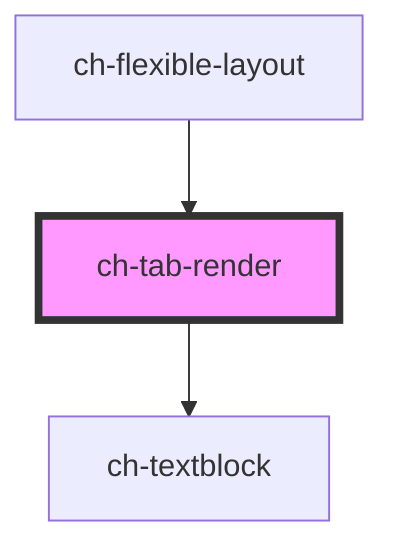

# ch-tab-render

<!-- Auto Generated Below -->

## Overview

The `ch-tab-render` component renders a tabbed interface where each tab button switches the visible content panel.

## Features
 - Tab list positioning along any edge of the container (`block-start`, `block-end`, `inline-start`, or `inline-end`).
 - Optional images, icons, captions, and close buttons per tab.
 - Keyboard navigation following WAI-ARIA tab patterns.
 - Drag-to-reorder tabs within the tab list when `sortable` is enabled.
 - Drag tabs outside the component for relocation in a flexible layout context when `dragOutside` is enabled.
 - CSS containment and overflow configuration per tab panel.

## Use when
 - Building a multi-panel UI where content should be switchable through labeled tabs (settings dialogs, property inspectors, IDE-style editor groups).
 - Organizing related but independent content sections within the same context (e.g., "Overview", "Files", "Commits").
 - Users need to view one section at a time without leaving the page.

## Do not use when
 - Showing or hiding a single content section -- prefer an accordion instead.
 - Users must compare content across sections — switching back and forth is too costly.
 - The sections represent different pages or routes — prefer `ch-navigation-list-render`.
 - Content follows a sequential linear process — prefer a stepper/wizard pattern.
 - More than 6 tabs are needed — consider a sidebar or `ch-navigation-list-render`.
 - Confusing with `ch-segmented-control-render`: tabs switch to DIFFERENT content sections; segmented controls switch the VIEW FORMAT of the same data.

## Accessibility
 - Implements the WAI-ARIA Tabs pattern with `role="tablist"`, `role="tab"`, and `role="tabpanel"`.
 - Supports keyboard navigation: Arrow keys to move between tabs, Home/End to jump to first/last.
 - Each tab button reflects `aria-selected` and `aria-controls` linking to its panel.
 - Close buttons carry an accessible label.

## Properties

| Property                    | Attribute                      | Description                                                                                                                                                                                                                                                                                                                                                                                                                                     | Type                                                                                                                                                                                                                                                                                                                                                                                                                                                                               | Default                     |
| --------------------------- | ------------------------------ | ----------------------------------------------------------------------------------------------------------------------------------------------------------------------------------------------------------------------------------------------------------------------------------------------------------------------------------------------------------------------------------------------------------------------------------------------- | ---------------------------------------------------------------------------------------------------------------------------------------------------------------------------------------------------------------------------------------------------------------------------------------------------------------------------------------------------------------------------------------------------------------------------------------------------------------------------------- | --------------------------- |
| `accessibleName`            | `accessible-name`              | Specifies a short string, typically 1 to 3 words, that authors associate with an element to provide users of assistive technologies with a label for the element.                                                                                                                                                                                                                                                                               | `string`                                                                                                                                                                                                                                                                                                                                                                                                                                                                           | `undefined`                 |
| `closeButton`               | `close-button`                 | `true` to display a close button for the items.                                                                                                                                                                                                                                                                                                                                                                                                 | `boolean`                                                                                                                                                                                                                                                                                                                                                                                                                                                                          | `false`                     |
| `closeButtonAccessibleName` | `close-button-accessible-name` | Specifies a short string, typically 1 to 3 words, that authors associate with an element to provide users of assistive technologies with a label for the element. This label is used for the close button of the captions.                                                                                                                                                                                                                      | `string`                                                                                                                                                                                                                                                                                                                                                                                                                                                                           | `"Close"`                   |
| `contain`                   | `contain`                      | Same as the contain CSS property. This property indicates that an item and its contents are, as much as possible, independent from the rest of the document tree. Containment enables isolating a subsection of the DOM, providing performance benefits by limiting calculations of layout, style, paint, size, or any combination to a DOM subtree rather than the entire page. Containment can also be used to scope CSS counters and quotes. | `"content" \| "inline-size" \| "layout" \| "none" \| "paint" \| "size" \| "strict" \| "style"`                                                                                                                                                                                                                                                                                                                                                                                     | `"none"`                    |
| `disabled`                  | `disabled`                     | This attribute lets you specify if all tab buttons are disabled. If disabled, tab buttons will not fire any user interaction related event (for example, click event).                                                                                                                                                                                                                                                                          | `boolean`                                                                                                                                                                                                                                                                                                                                                                                                                                                                          | `false`                     |
| `dragOutside`               | `drag-outside`                 | When the control is sortable, the items can be dragged outside of the tab-list.  This property lets you specify if this behavior is enabled.                                                                                                                                                                                                                                                                                                    | `boolean`                                                                                                                                                                                                                                                                                                                                                                                                                                                                          | `false`                     |
| `expanded`                  | `expanded`                     | `true` if the group has is view section expanded. Otherwise, only the toolbar will be displayed.                                                                                                                                                                                                                                                                                                                                                | `boolean`                                                                                                                                                                                                                                                                                                                                                                                                                                                                          | `true`                      |
| `getImagePathCallback`      | --                             | This property specifies a callback that is executed when the path for an startImgSrc needs to be resolved.                                                                                                                                                                                                                                                                                                                                      | `(imageSrc: string) => GxImageMultiState`                                                                                                                                                                                                                                                                                                                                                                                                                                          | `undefined`                 |
| `model`                     | --                             | Specifies the items of the tab control.                                                                                                                                                                                                                                                                                                                                                                                                         | `TabItemModel[]`                                                                                                                                                                                                                                                                                                                                                                                                                                                                   | `undefined`                 |
| `overflow`                  | `overflow`                     | Same as the overflow CSS property. This property sets the desired behavior when content does not fit in the item's padding box (overflows) in the horizontal and/or vertical direction.                                                                                                                                                                                                                                                         | `CssOverflowProperty \| "auto auto" \| "auto hidden" \| "auto clip" \| "auto scroll" \| "auto visible" \| "hidden auto" \| "hidden hidden" \| "hidden clip" \| "hidden scroll" \| "hidden visible" \| "clip auto" \| "clip hidden" \| "clip clip" \| "clip scroll" \| "clip visible" \| "scroll auto" \| "scroll hidden" \| "scroll clip" \| "scroll scroll" \| "scroll visible" \| "visible auto" \| "visible hidden" \| "visible clip" \| "visible scroll" \| "visible visible"` | `"visible"`                 |
| `selectedId`                | `selected-id`                  | Specifies the selected item of the widgets array.                                                                                                                                                                                                                                                                                                                                                                                               | `string`                                                                                                                                                                                                                                                                                                                                                                                                                                                                           | `undefined`                 |
| `showCaptions`              | `show-captions`                | `true` to show the captions of the items.                                                                                                                                                                                                                                                                                                                                                                                                       | `boolean`                                                                                                                                                                                                                                                                                                                                                                                                                                                                          | `true`                      |
| `showTabListEnd`            | `show-tab-list-end`            | `true` to render a slot named "tab-list-end" to project content at the end position of the tab-list ("after" the tab buttons).                                                                                                                                                                                                                                                                                                                  | `boolean`                                                                                                                                                                                                                                                                                                                                                                                                                                                                          | `false`                     |
| `showTabListStart`          | `show-tab-list-start`          | `true` to render a slot named "tab-list-start" to project content at the start position of the tab-list ("before" the tab buttons).                                                                                                                                                                                                                                                                                                             | `boolean`                                                                                                                                                                                                                                                                                                                                                                                                                                                                          | `false`                     |
| `sortable`                  | `sortable`                     | `true` to enable sorting the tab buttons by dragging them in the tab-list.  If `false`, the tab buttons can not be dragged out either.                                                                                                                                                                                                                                                                                                          | `boolean`                                                                                                                                                                                                                                                                                                                                                                                                                                                                          | `false`                     |
| `tabButtonHidden`           | `tab-button-hidden`            | `true` to not render the tab buttons of the control.                                                                                                                                                                                                                                                                                                                                                                                            | `boolean`                                                                                                                                                                                                                                                                                                                                                                                                                                                                          | `false`                     |
| `tabListPosition`           | `tab-list-position`            | Specifies the position of the tab list of the `ch-tab-render`.                                                                                                                                                                                                                                                                                                                                                                                  | `"block-end" \| "block-start" \| "inline-end" \| "inline-start"`                                                                                                                                                                                                                                                                                                                                                                                                                   | `DEFAULT_TAB_LIST_POSITION` |

## Events

| Event                | Description                                                                                             | Type                                                                                           |
| -------------------- | ------------------------------------------------------------------------------------------------------- | ---------------------------------------------------------------------------------------------- |
| `expandMainGroup`    | Fired when an item of the main group is double clicked.                                                 | `CustomEvent<string>`                                                                          |
| `itemClose`          | Fired the close button of an item is clicked.                                                           | `CustomEvent<{ itemId: string; itemIndex: number; }>`                                          |
| `itemDragStart`      | Fired the first time a caption button is dragged outside of its tab list.                               | `CustomEvent<number>`                                                                          |
| `selectedItemChange` | Fired when the selected item change. This event can be default prevented to prevent the item selection. | `CustomEvent<{ lastSelectedIndex: number; newSelectedId: string; newSelectedIndex: number; }>` |

## Methods

### `endDragPreview() => Promise<void>`

Ends the preview of the dragged item. Useful for ending the preview via
keyboard interaction.

#### Returns

Type: `Promise<void>`

### `getDraggableViews() => Promise<DraggableViewInfo>`

Returns the info associated to the draggable view.

#### Returns

Type: `Promise<DraggableViewInfo>`

### `promoteDragPreviewToTopLayer() => Promise<void>`

Promotes the drag preview to the top layer. Useful to avoid z-index issues.

#### Returns

Type: `Promise<void>`

### `removePage(pageId: string, forceRerender?: boolean) => Promise<void>`

Given an id, remove the page from the render

#### Parameters

| Name            | Type      | Description |
| --------------- | --------- | ----------- |
| `pageId`        | `string`  |             |
| `forceRerender` | `boolean` |             |

#### Returns

Type: `Promise<void>`

## Slots

| Slot                  | Description                                                                                                         |
| --------------------- | ------------------------------------------------------------------------------------------------------------------- |
| `"{item.id}"`         | Named slot for each tab panel's content, projected when the tab has been rendered at least once.                    |
| `"{tabListPosition}"` | Named slot rendered adjacent to the tab list for custom toolbar content (e.g., an overflow menu or add-tab button). |

## Shadow Parts

| Part                         | Description                                                                                                             |
| ---------------------------- | ----------------------------------------------------------------------------------------------------------------------- |
| `"block"`                    | Present when the tab list is oriented vertically (block direction).                                                     |
| `"closable"`                 | Present in the `tab` and `tab-caption` parts when the item has a close button.                                          |
| `"close-button"`             | The button that closes a tab. Rendered when `closeButton` is `true` and the item is closable.                           |
| `"collapsed"`                | Present in the `tab-panel-container` part when the panel container is hidden.                                           |
| `"disabled"`                 | Present in the `tab`, `tab-caption`, `close-button`, and `tab-panel` parts when the item is disabled.                   |
| `"dragging"`                 | Present in the `tab`, `close-button`, and `tab-list` parts while a tab is being dragged.                                |
| `"dragging-out-of-tab-list"` | Present in the `tab` and `close-button` parts while dragging outside the tab list bounds.                               |
| `"dragging-over-tab-list"`   | Present in the `tab` and `close-button` parts while dragging within the tab list bounds.                                |
| `"end"`                      | Present when the tab list is positioned at the end edge.                                                                |
| `"expanded"`                 | Present in the `tab-panel-container` part when the panel container is visible.                                          |
| `"img"`                      | The `` element rendered when a tab item uses `startImgSrc` with `startImgType = "img"`.                            |
| `"inline"`                   | Present when the tab list is oriented horizontally (inline direction).                                                  |
| `"not-closable"`             | Present in the `tab` and `tab-caption` parts when the item does not have a close button.                                |
| `"not-selected"`             | Present in the `tab`, `tab-caption`, `close-button`, and `tab-panel` parts when the item is not selected.               |
| `"selected"`                 | Present in the `tab`, `tab-caption`, `close-button`, and `tab-panel` parts when the item is selected.                   |
| `"start"`                    | Present when the tab list is positioned at the start edge.                                                              |
| `"tab"`                      | The primary `<button>` element for each tab item. Also receives the `{item.id}`, position, state, and direction parts.  |
| `"tab-caption"`              | The `<ch-textblock>` text label inside each tab button. Present when `showCaptions` is `true`.                          |
| `"tab-list"`                 | The `
` that wraps all tab buttons and acts as the `role="tablist"` container.                                      |
| `"tab-list-end"`             | The `
` adjacent to the end of the tab list. Used to project toolbar content via `slot={tabListPosition}`.          |
| `"tab-list-start"`           | The `
` adjacent to the start of the tab list. Used to project toolbar content via `slot={tabListPosition}`.        |
| `"tab-panel"`                | The panel `
` for each tab's content area. Receives `{item.id}`, position, and state parts.                         |
| `"tab-panel-container"`      | The outer container `
` that wraps all tab panels.                                                                  |
| `"{item.id}"`                | Present on the `tab`, `tab-caption`, `close-button`, and `tab-panel` parts for each tab item, enabling per-tab styling. |

## CSS Custom Properties

| Name                                           | Description                                                                                |
| ---------------------------------------------- | ------------------------------------------------------------------------------------------ |
| `--ch-tab-button__background-image-size`       | Specifies the size of the start images of the tab buttons. @default 100%                   |
| `--ch-tab-button__image-size`                  | Specifies the box size that contains the start images of the tab buttons. @default 0.875em |
| `--ch-tab-close-button__background-image-size` | Specifies the image size of the close button. @default 100%                                |
| `--ch-tab-close-button__image-size`            | Specifies the box size that contains an image for the close button. @default 0.875em       |

## Dependencies

### Used by

 - [ch-flexible-layout](../flexible-layout/internal/flexible-layout)

### Depends on

- [ch-textblock](../textblock)

### Graph

```mermaid
graph TD;
  ch-tab-render --> ch-textblock
  ch-flexible-layout --> ch-tab-render
  style ch-tab-render fill:#f9f,stroke:#333,stroke-width:4px
```

----------------------------------------------

*Built with [StencilJS](https://stenciljs.com/)*
