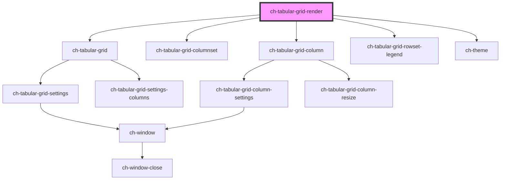

# ch-tabular-grid-render

<!-- Auto Generated Below -->

## Properties

| Property          | Attribute          | Description                                           | Type                                                                      | Default     |
| ----------------- | ------------------ | ----------------------------------------------------- | ------------------------------------------------------------------------- | ----------- |
| `columnHideable`  | `column-hideable`  | Determines if the columns can be hidden by the user   | `boolean`                                                                 | `true`      |
| `columnResizable` | `column-resizable` | Determines if the columns can be resized by the user. | `boolean`                                                                 | `true`      |
| `columnSortable`  | `column-sortable`  | Determines if the columns can be sorted by the user.  | `boolean`                                                                 | `true`      |
| `model`           | --                 | Specifies the content of the tabular grid control.    | `{ columns: TabularGridColumnsModel; rowsets: TabularGridRowsetsModel; }` | `undefined` |
| `theme`           | `theme`            | Determines if the columns can be hidden by the user   | `string`                                                                  | `undefined` |

## Dependencies

### Depends on

- [ch-tabular-grid](../tabular-grid)
- [ch-tabular-grid-columnset](../tabular-grid/columnset)
- [ch-tabular-grid-column](../tabular-grid/column)
- [ch-tabular-grid-rowset-legend](../tabular-grid/rowset/legend)
- [ch-theme](../theme)

### Graph

----------------------------------------------

*Built with [StencilJS](https://stenciljs.com/)*
