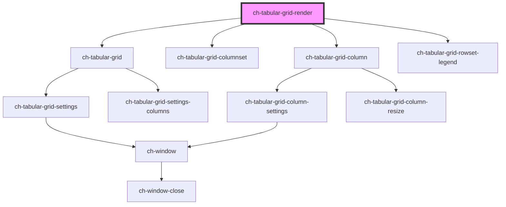

# ch-tabular-grid-render

<!-- Auto Generated Below -->

## Properties

| Property | Attribute | Description                                        | Type                                                                        | Default     |
| -------- | --------- | -------------------------------------------------- | --------------------------------------------------------------------------- | ----------- |
| `model`  | --        | Specifies the content of the tabular grid control. | `{ columns: TabularGridColumnModel[]; rowsets: TabularGridRowsetModel[]; }` | `undefined` |

## Dependencies

### Depends on

- [ch-tabular-grid](../tabular-grid)
- [ch-tabular-grid-columnset](../tabular-grid/columnset)
- [ch-tabular-grid-column](../tabular-grid/column)
- [ch-tabular-grid-rowset-legend](../tabular-grid/rowset/legend)

### Graph

----------------------------------------------

*Built with [StencilJS](https://stenciljs.com/)*
