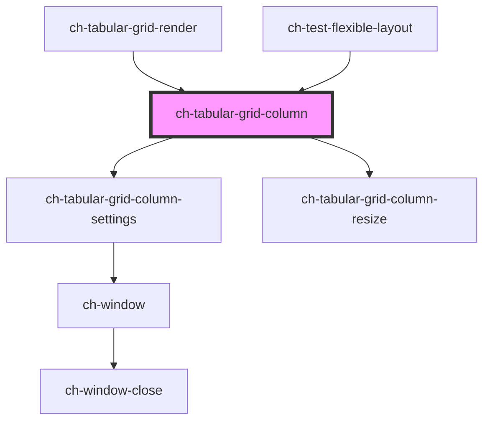

# ch-grid-column

<!-- Auto Generated Below -->

## Overview

The `ch-tabular-grid-column` component represents a grid column.

## Properties

| Property               | Attribute                 | Description                                                                                                                                                                                                                                                                | Type                                 | Default     |
| ---------------------- | ------------------------- | -------------------------------------------------------------------------------------------------------------------------------------------------------------------------------------------------------------------------------------------------------------------------- | ------------------------------------ | ----------- |
| `columnIconUrl`        | `column-icon-url`         | **[DEPRECATED]** Use "columnImage" or "columnImageSet" instead. A URL to an icon to display in the column header.                                                                                                                   | `string`                             | `undefined` |
| `columnId`             | `column-id`               | A unique identifier for the column.                                                                                                                                                                                                                                        | `string`                             | `undefined` |
| `columnImage`          | `column-image`            | A URL to an icon to display in the column header.                                                                                                                                                                                                                          | `string`                             | `undefined` |
| `columnImageSet`       | `column-image-set`        | A URL to an icon to display in the column header.                                                                                                                                                                                                                          | `string`                             | `undefined` |
| `columnName`           | `column-name`             | The text to display in the column header and settings.                                                                                                                                                                                                                     | `string`                             | `undefined` |
| `columnNameHidden`     | `column-name-hidden`      | Indicates whether the text in the column header is visible or not                                                                                                                                                                                                          | `boolean`                            | `undefined` |
| `columnNamePosition`   | `column-name-position`    | **[DEPRECATED]** Use "columnTooltip" and "columnNameHidden" instead. One of "text" or "title", indicating whether the `columnName` should be displayed as the column text or as tooltip of the column image.                        | `"text" \| "title"`                  | `"text"`    |
| `columnTooltip`        | `column-tooltip`          | The text to display when the cursor is placed over the column header.                                                                                                                                                                                                      | `string`                             | `undefined` |
| `columnType`           | `column-type`             | One of "plain", "rich", or "tree", indicating the type of cell displayed in the column.                                                                                                                                                                                    | `"plain" \| "rich" \| "tree"`        | `"plain"`   |
| `displayObserverClass` | `display-observer-class`  | A CSS class name to apply to the display observer element used to detect changes in the column visibility.                                                                                                                                                                 | `string`                             | `undefined` |
| `freeze`               | `freeze`                  | One of "left" or "right", indicating whether the column should be "frozen" (i.e. remain visible when the user scrolls horizontally).                                                                                                                                       | `"end" \| "start"`                   | `undefined` |
| `hidden`               | `hidden`                  | A boolean indicating whether the column should be hidden. The user can display it from the grid settings.                                                                                                                                                                  | `boolean`                            | `false`     |
| `hideable`             | `hideable`                | A boolean indicating whether the column should be hideable (i.e. whether the user should be able to show/hide the column).                                                                                                                                                 | `boolean`                            | `true`      |
| `order`                | `order`                   | A number indicating the order in which the column should appear.                                                                                                                                                                                                           | `number`                             | `undefined` |
| `parts`                | `parts`                   | A boolean or string that controls the parts applied to the column. - When `true`, it automatically applies the part names "column" and the column's unique ID. - When a string is provided, it appends that string to the default part names "column" and the column's ID. | `boolean \| string`                  | `undefined` |
| `physicalOrder`        | `physical-order`          | A number indicating the physical order of the column (i.e. its position in the DOM).                                                                                                                                                                                       | `number`                             | `undefined` |
| `resizable`            | `resizable`               | A boolean indicating whether the column should be resizable (i.e. whether the user should be able to drag its width).                                                                                                                                                      | `boolean`                            | `true`      |
| `resizing`             | `resizing`                | A boolean indicating whether the column is currently being resized.                                                                                                                                                                                                        | `boolean`                            | `undefined` |
| `richRowActions`       | `rich-row-actions`        | A boolean indicating whether the column cells in the grid should have a set of action buttons (only applicable for columnType="rich").                                                                                                                                     | `boolean`                            | `undefined` |
| `richRowDrag`          | `rich-row-drag`           | A boolean value indicating whether the column cells are draggable to reorder the grid rows (only applicable for columnType="rich").                                                                                                                                        | `boolean`                            | `undefined` |
| `richRowSelector`      | `rich-row-selector`       | A boolean indicating whether the column cells in the grid should have a checkbox selector (only applicable for columnType="rich").                                                                                                                                         | `boolean`                            | `undefined` |
| `richRowSelectorMode`  | `rich-row-selector-mode`  | One of "select" or "mark", indicating the mode of rich row selector. "select" indicates that the row selector is bound to the row selection. "mark" allows to mark a row independently of the selection.                                                                   | `"mark" \| "select"`                 | `"select"`  |
| `richRowSelectorState` | `rich-row-selector-state` | Indicate the state of the rich row selector. "" indicates that all rows are unchecked. "checked" indicates that all rows are checked. "indeterminate" indicates that some rows are marked.                                                                                 | `"" \| "checked" \| "indeterminate"` | `""`        |
| `settingable`          | `settingable`             | A boolean indicating whether the user should be able to open a settings panel for the column.                                                                                                                                                                              | `boolean`                            | `true`      |
| `showSettings`         | `show-settings`           | A boolean indicating whether the settings panel for the column should be visible.                                                                                                                                                                                          | `boolean`                            | `false`     |
| `size`                 | `size`                    | A string indicating the width of the column. Any value supported by the "grid-template-columns" CSS property is valid.                                                                                                                                                     | `string`                             | `undefined` |
| `sortDirection`        | `sort-direction`          | One of "asc" or "desc", indicating the current sort direction.                                                                                                                                                                                                             | `"asc" \| "desc"`                    | `undefined` |
| `sortable`             | `sortable`                | A boolean indicating whether the column should be sortable (i.e. whether the user should be able to click the column header to sort the data).                                                                                                                             | `boolean`                            | `true`      |

## Events

| Event                   | Description                                                                                                              | Type                                                 |
| ----------------------- | ------------------------------------------------------------------------------------------------------------------------ | ---------------------------------------------------- |
| `columnDragEnded`       | Event emitted when the user stops dragging the column header to move it.                                                 | `CustomEvent<TabularGridColumnDragEvent>`            |
| `columnDragging`        | Event emitted when the user is dragging the column header to move it.                                                    | `CustomEvent<TabularGridColumnDragEvent>`            |
| `columnDragStarted`     | Event emitted when the user is dragging the column header to move it.                                                    | `CustomEvent<TabularGridColumnDragEvent>`            |
| `columnFreezeChanged`   | Event emitted when the `freeze` property is changed.                                                                     | `CustomEvent<TabularGridColumnFreezeChangedEvent>`   |
| `columnHiddenChanged`   | Event emitted when the `hidden` property is changed.                                                                     | `CustomEvent<TabularGridColumnHiddenChangedEvent>`   |
| `columnOrderChanged`    | Event emitted when the `order` property is changed.                                                                      | `CustomEvent<TabularGridColumnOrderChangedEvent>`    |
| `columnSelectorClicked` | Event emitted when the user clicks the row selector checkbox (only applicable for `richRowSelector="true"`.              | `CustomEvent<TabularGridColumnSelectorClickedEvent>` |
| `columnSizeChanged`     | Event emitted when the `size` property has been changed (i.e. when the user finishes dragging to resize the column).     | `CustomEvent<TabularGridColumnSizeChangedEvent>`     |
| `columnSizeChanging`    | Event emitted when the `size` property is currently being changed (i.e. when the user is dragging to resize the column). | `CustomEvent<TabularGridColumnSizeChangedEvent>`     |
| `columnSortChanged`     | Event emitted when the `sortDirection` property is changed.                                                              | `CustomEvent<TabularGridColumnSortChangedEvent>`     |

## Shadow Parts

| Part                    | Description |
| ----------------------- | ----------- |
| `"bar"`                 |             |
| `"bar-name"`            |             |
| `"bar-name-icon"`       |             |
| `"bar-name-text"`       |             |
| `"bar-resize"`          |             |
| `"bar-resize-split"`    |             |
| `"bar-selector"`        |             |
| `"bar-settings"`        |             |
| `"bar-settings-button"` |             |
| `"bar-sort"`            |             |
| `"bar-sort-ascending"`  |             |
| `"bar-sort-descending"` |             |
| `"selector-label"`      |             |

## Dependencies

### Used by

 - [ch-tabular-grid-render](../../tabular-grid-render)
 - [ch-test-flexible-layout](../../test/test-flexible-layout)

### Depends on

- [ch-tabular-grid-column-settings](settings)
- [ch-tabular-grid-column-resize](resize)

### Graph

----------------------------------------------

*Built with [StencilJS](https://stenciljs.com/)*
