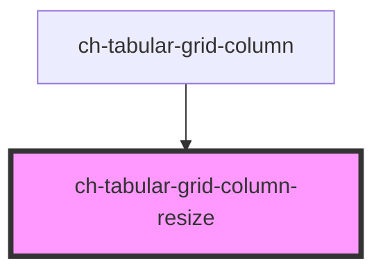

# ch-grid-column-resize

<!-- Auto Generated Below -->

## Overview

The `ch-tabular-grid-column-resize` component responsible for resizing a column in a grid.

## Properties

| Property              | Attribute | Description                               | Type                             | Default     |
| --------------------- | --------- | ----------------------------------------- | -------------------------------- | ----------- |
| `column` _(required)_ | --        | The column element that is being resized. | `HTMLChTabularGridColumnElement` | `undefined` |

## Events

| Event                  | Description                                               | Type                                        |
| ---------------------- | --------------------------------------------------------- | ------------------------------------------- |
| `columnResizeFinished` | Event emitted when the user finishes resizing the column. | `CustomEvent<TabularGridColumnResizeEvent>` |
| `columnResizeStarted`  | Event emitted when the user starts resizing the column.   | `CustomEvent<TabularGridColumnResizeEvent>` |
| `columnResizing`       | Event emitted when the user is resizing the column.       | `CustomEvent<TabularGridColumnResizeEvent>` |

## Dependencies

### Used by

 - [ch-tabular-grid-column](..)

### Graph

----------------------------------------------

*Built with [StencilJS](https://stenciljs.com/)*
