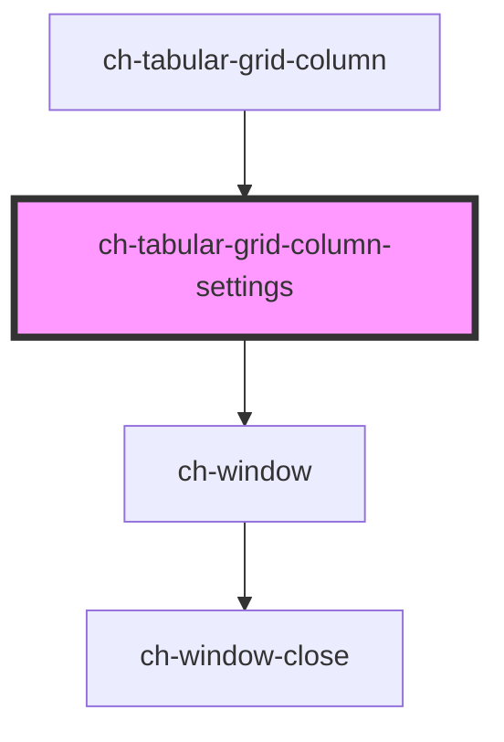

# ch-grid-menu-columns

<!-- Auto Generated Below -->

## Overview

The `ch-tabular-grid-column-settings` component represents a settings window for a column.

## Properties

| Property              | Attribute | Description                                                                       | Type                             | Default     |
| --------------------- | --------- | --------------------------------------------------------------------------------- | -------------------------------- | ----------- |
| `column` _(required)_ | `column`  | The `HTMLChTabularGridColumnElement` that the settings window is associated with. | `HTMLChTabularGridColumnElement` | `undefined` |
| `show`                | `show`    | Indicates whether the settings window is currently shown or not.                  | `boolean`                        | `false`     |

## Dependencies

### Used by

 - [ch-tabular-grid-column](..)

### Depends on

- [ch-window](../../../../deprecated-components/window)

### Graph

----------------------------------------------

*Built with [StencilJS](https://stenciljs.com/)*
