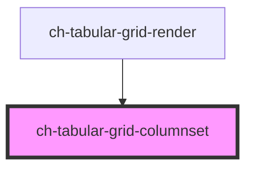

# ch-grid-columnset

<!-- Auto Generated Below -->

## Overview

The `ch-tabular-grid-columnset` component represents a group of columns.

## Dependencies

### Used by

 - [ch-tabular-grid-render](../../tabular-grid-render)

### Graph

----------------------------------------------

*Built with [StencilJS](https://stenciljs.com/)*
