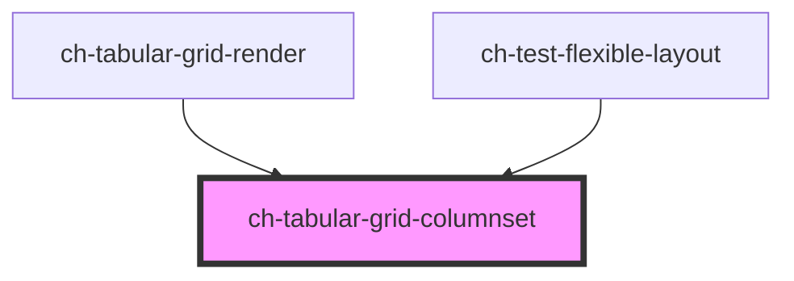

# ch-grid-columnset

<!-- Auto Generated Below -->

## Overview

The `ch-tabular-grid-columnset` component represents a group of columns.

## Properties

| Property | Attribute | Description                                                                                                                                                                                                                                                                | Type                | Default     |
| -------- | --------- | -------------------------------------------------------------------------------------------------------------------------------------------------------------------------------------------------------------------------------------------------------------------------- | ------------------- | ----------- |
| `parts`  | `parts`   | A boolean or string that controls the parts applied to the column. - When `true`, it automatically applies the part names "column" and the column's unique ID. - When a string is provided, it appends that string to the default part names "column" and the column's ID. | `boolean \| string` | `undefined` |

## Dependencies

### Used by

 - [ch-tabular-grid-render](../../tabular-grid-render)
 - [ch-test-flexible-layout](../../test/test-flexible-layout)

### Graph

----------------------------------------------

*Built with [StencilJS](https://stenciljs.com/)*
