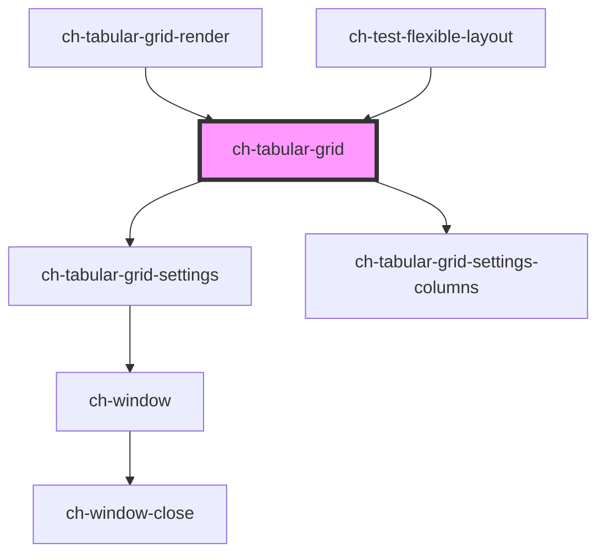

# ch-grid

## Table of Contents

- [Overview](#overview)
- [Features](#features)
- [Use when](#use-when)
- [Do not use when](#do-not-use-when)
- [Accessibility](#accessibility)
- [Properties](#properties)
- [Events](#events)
- [Methods](#methods)
  - [`cellEnsureVisible`](#cellensurevisible)
  - [`collapseRow`](#collapserow)
  - [`expandRow`](#expandrow)
  - [`getFocusedCell`](#getfocusedcell)
  - [`getFocusedRow`](#getfocusedrow)
  - [`getHoveredRow`](#gethoveredrow)
  - [`getMarkedRows`](#getmarkedrows)
  - [`getNextCell`](#getnextcell)
  - [`getNextRow`](#getnextrow)
  - [`getPreviousCell`](#getpreviouscell)
  - [`getPreviousRow`](#getpreviousrow)
  - [`getSelectedCell`](#getselectedcell)
  - [`getSelectedRows`](#getselectedrows)
  - [`markAllRows`](#markallrows)
  - [`markRow`](#markrow)
  - [`rowEnsureVisible`](#rowensurevisible)
  - [`selectAllRows`](#selectallrows)
  - [`selectCell`](#selectcell)
  - [`selectRow`](#selectrow)
  - [`syncRowState`](#syncrowstate)
- [Slots](#slots)
- [Dependencies](#dependencies)
  - [Used by](#used-by)
  - [Depends on](#depends-on)
  - [Graph](#graph)
- [Styling](./docs/styling.md)

<!-- Auto Generated Below -->

## Overview

The `ch-tabular-grid` component is a full-featured, accessible data grid and tree grid for displaying, selecting, and interacting with tabular data.

## Features
 - Single and multiple row selection, cell-level selection, and row marking (checkboxes).
 - Row and cell highlighting on hover.
 - Full keyboard navigation (Arrow keys, Home/End, PageUp/PageDown, Enter, Space, +/- for tree expand/collapse).
 - Column reordering via drag-and-drop (controlled by `allowColumnReorder`).
 - Column resizing in `"single"` or `"splitter"` mode.
 - Row expand/collapse for hierarchical tree data.
 - Context menus and row actions via slotted content.
 - Touch support for mobile devices (tap-to-select).
 - Built-in settings panel for column visibility.
 - Rich set of public methods and events for programmatic control.

## Use when
 - Displaying and interacting with structured tabular or hierarchical data.
 - Users need to select, sort, reorder, or resize columns interactively.
 - The data has a tree/hierarchy that benefits from inline expand/collapse.

## Do not use when
 - Displaying a simple list or card layout -- use `ch-smart-grid` instead.
 - Simple display-only lists without interactivity -- use a semantic `<table>` or `ch-action-list-render` instead.

## Accessibility
 - Full keyboard navigation: Arrow keys to move between cells, Home/End for row boundaries, PageUp/PageDown for vertical scrolling, Enter for row press, Space for toggle/mark, +/- for tree expand/collapse.
 - Supports row and cell selection semantics with configurable selection modes (`rowSelectionMode`).
 - Hierarchical tree-grid rows support expand/collapse via keyboard.
 - Focus is managed on the host element; row and cell focus states are tracked internally and exposed via CSS classes.

## Properties

| Property                 | Attribute                  | Description                                                                                                                                                                                                                                                                                                                                                                                                                                                                                                                                                                                                                                                                                                 | Type                                                                                      | Default     |
| ------------------------ | -------------------------- | ----------------------------------------------------------------------------------------------------------------------------------------------------------------------------------------------------------------------------------------------------------------------------------------------------------------------------------------------------------------------------------------------------------------------------------------------------------------------------------------------------------------------------------------------------------------------------------------------------------------------------------------------------------------------------------------------------------- | ----------------------------------------------------------------------------------------- | ----------- |
| `allowColumnReorder`     | `allow-column-reorder`     | `true` to allow the user to drag column headers to reorder columns. When `false`, column headers are not draggable and the order is fixed.                                                                                                                                                                                                                                                                                                                                                                                                                                                                                                                                                                  | `boolean`                                                                                 | `true`      |
| `columnResizeMode`       | `column-resize-mode`       | Controls the behavior of column resizing:  - `"single"`: Only the dragged column's width changes; the grid may    grow or shrink horizontally.  - `"splitter"`: Adjusting one column proportionally resizes the    neighboring column, maintaining the overall grid width.                                                                                                                                                                                                                                                                                                                                                                                                                                  | `"single" \| "splitter"`                                                                  | `"single"`  |
| `keyboardNavigationMode` | `keyboard-navigation-mode` | Specifies the keyboard navigation mode for the component. - "none": Disables keyboard navigation for the grid rows. - "select": Allows keyboard navigation by changing the selection of grid rows. - "focus": Allows keyboard navigation by focusing on grid rows, but does not change the selection.                                                                                                                                                                                                                                                                                                                                                                                                       | `"focus" \| "none" \| "select"`                                                           | `"select"`  |
| `localization`           | --                         | An object that contains localized strings for the grid UI (e.g., settings panel labels, accessibility announcements). When `undefined`, default English strings are used.                                                                                                                                                                                                                                                                                                                                                                                                                                                                                                                                   | `GridLocalization`                                                                        | `undefined` |
| `rowFocusedClass`        | `row-focused-class`        | A CSS class name applied to a row when it is focused via keyboard navigation. When `undefined`, no class is applied.                                                                                                                                                                                                                                                                                                                                                                                                                                                                                                                                                                                        | `string`                                                                                  | `undefined` |
| `rowHighlightEnabled`    | `row-highlight-enabled`    | Controls whether rows are visually highlighted on hover:  - `"auto"`: Highlighting is enabled when `rowSelectionMode` is    `"single"` or `"multiple"`, disabled when `"none"`.  - `true`: Always enabled regardless of selection mode.  - `false`: Always disabled.  When enabled, the `rowHighlightedClass` CSS class is applied to the hovered row and the `row-actions` slot (if configured) is shown.                                                                                                                                                                                                                                                                                                  | `"auto" \| boolean`                                                                       | `"auto"`    |
| `rowHighlightedClass`    | `row-highlighted-class`    | A CSS class name applied to a row when it is hovered (highlighted). When `undefined`, no class is applied. Only takes effect when `rowHighlightEnabled` is active.                                                                                                                                                                                                                                                                                                                                                                                                                                                                                                                                          | `string`                                                                                  | `undefined` |
| `rowMarkedClass`         | `row-marked-class`         | A CSS class name applied to a row when it is marked (checked via the row selector checkbox). When `undefined`, no class is applied. Only relevant when the column selector's `richRowSelectorMode` is `"mark"`.                                                                                                                                                                                                                                                                                                                                                                                                                                                                                             | `string`                                                                                  | `undefined` |
| `rowSelectedClass`       | `row-selected-class`       | A CSS class name applied to a row when it is selected. When `undefined`, no class is applied. Applied to `ch-tabular-grid-row` elements that are in the selected state.                                                                                                                                                                                                                                                                                                                                                                                                                                                                                                                                     | `string`                                                                                  | `undefined` |
| `rowSelectionMode`       | `row-selection-mode`       | Controls how rows can be selected:  - `"none"`: No rows are selectable. Pointer and keyboard interactions    will not trigger selection events.  - `"single"`: Only one row can be selected at a time.  - `"multiple"`: Multiple rows can be selected using Ctrl/Cmd+click or    Shift+click.  Also affects `rowHighlightEnabled` when set to `"auto"` -- highlighting is enabled for `"single"` and `"multiple"` modes.                                                                                                                                                                                                                                                                                    | `"multiple" \| "none" \| "single"`                                                        | `"single"`  |
| `showLines`              | `show-lines`               | Defines which lines (or borders) are displayed within the tabular grid. Similar to the border options in spreadsheet applications, this property controls whether lines appear around and/or between rows and columns.  **Note:** At the moment, this property does not affect the rendering of the grid. It only reflects the property value as an HTML attribute.  - "all": Lines around and between all rows and columns. - "all-inside": Lines only between rows and columns. - "column": Lines around and between columns. - "column-inside": Lines only between columns. - "none": No lines at all. - "row": Lines around and between rows. - "row-inside": Lines only between rows.  Default: "all". | `"all" \| "all-inside" \| "column" \| "column-inside" \| "none" \| "row" \| "row-inside"` | `"all"`     |

## Events

| Event                  | Description                                                                                                                                                                                                                                                                                        | Type                                                |
| ---------------------- | -------------------------------------------------------------------------------------------------------------------------------------------------------------------------------------------------------------------------------------------------------------------------------------------------- | --------------------------------------------------- |
| `cellSelectionChanged` | Emitted when the selected cell changes (a different cell gains selection). Payload contains `cellId`, `rowId`, and `columnId` of the newly selected cell, or `null` values if no cell is selected. Not cancelable.                                                                                 | `CustomEvent<TabularGridCellSelectionChangedEvent>` |
| `rowClicked`           | Emitted when a row is clicked (single click via pointer or touch). Payload contains `rowId`, `cellId`, and `columnId`. Not cancelable.                                                                                                                                                             | `CustomEvent<TabularGridRowClickedEvent>`           |
| `rowContextMenu`       | Emitted when a context menu is requested on a row (right-click or keyboard shortcut). Cancelable: calling `event.preventDefault()` suppresses the browser's native context menu. Payload includes `rowId`, `cellId`, `columnId`, `selectedRowsId`, and pointer coordinates (`clientX`, `clientY`). | `CustomEvent<TabularGridRowContextMenuEvent>`       |
| `rowDoubleClicked`     | Emitted when a row is double-clicked. Payload contains `rowId`, `cellId`, and `columnId`. Not cancelable.                                                                                                                                                                                          | `CustomEvent<TabularGridRowClickedEvent>`           |
| `rowEnterPressed`      | Emitted when Enter is pressed on a focused row. Payload contains `rowId` of the pressed row. Not cancelable.                                                                                                                                                                                       | `CustomEvent<TabularGridRowPressedEvent>`           |
| `rowMarkingChanged`    | Emitted when the set of marked rows changes (checkboxes toggled). Only fires when the column selector's `richRowSelectorMode` is `"mark"`. Not cancelable. Payload includes arrays of added and removed row IDs.                                                                                   | `CustomEvent<TabularGridMarkingChangedEvent>`       |
| `selectionChanged`     | Emitted when the set of selected rows changes (add, remove, or replace). Triggered by pointer clicks, keyboard navigation, or programmatic calls to `selectRow`/`selectAllRows`. Not cancelable. Payload includes arrays of added and removed row IDs.                                             | `CustomEvent<TabularGridSelectionChangedEvent>`     |

## Methods

### `cellEnsureVisible(cellId: string) => Promise<void>`

Ensures that the cell is visible within the control, scrolling the contents of the control if necessary.

#### Parameters

| Name     | Type     | Description                                    |
| -------- | -------- | ---------------------------------------------- |
| `cellId` | `string` | - The cellId of the cell to ensure visibility. |

#### Returns

Type: `Promise<void>`

### `collapseRow(rowId: string) => Promise<void>`

Collapses a hierarchical (tree-grid) row, hiding its children.
No-ops if the row is not found or is not collapsible.

#### Parameters

| Name    | Type     | Description                         |
| ------- | -------- | ----------------------------------- |
| `rowId` | `string` | - The rowId of the row to collapse. |

#### Returns

Type: `Promise<void>`

### `expandRow(rowId: string) => Promise<void>`

Expands a hierarchical (tree-grid) row, showing its children.
No-ops if the row is not found or is not expandable.

#### Parameters

| Name    | Type     | Description                       |
| ------- | -------- | --------------------------------- |
| `rowId` | `string` | - The rowId of the row to expand. |

#### Returns

Type: `Promise<void>`

### `getFocusedCell() => Promise<{ cellId: string; rowId: string; columnId: string; }>`

Retrieves information about the currently focused cell.

#### Returns

Type: `Promise<{ cellId: string; rowId: string; columnId: string; }>`

### `getFocusedRow() => Promise<string>`

Retrieves the rowId of the currently focused row.

#### Returns

Type: `Promise<string>`

### `getHoveredRow() => Promise<string>`

Retrieves the rowId of the currently hovered row.

#### Returns

Type: `Promise<string>`

### `getMarkedRows() => Promise<string[]>`

Retrieves the list of rowId of the marked rows.

#### Returns

Type: `Promise<string[]>`

### `getNextCell() => Promise<{ cellId: string; rowId: string; columnId: string; }>`

Retrieves information about the next cell relative to the currently selected cell.

#### Returns

Type: `Promise<{ cellId: string; rowId: string; columnId: string; }>`

### `getNextRow() => Promise<string | void>`

Retrieves the rowId of the next row relative to the currently selected cell.

#### Returns

Type: `Promise<string | void>`

### `getPreviousCell() => Promise<{ cellId: string; rowId: string; columnId: string; }>`

Retrieves information about the previous cell relative to the currently selected cell.

#### Returns

Type: `Promise<{ cellId: string; rowId: string; columnId: string; }>`

### `getPreviousRow() => Promise<string | void>`

Retrieves the rowId of the previous row relative to the currently selected cell.

#### Returns

Type: `Promise<string | void>`

### `getSelectedCell() => Promise<{ cellId: string; rowId: string; columnId: string; }>`

Retrieves information about the currently selected cell.

#### Returns

Type: `Promise<{ cellId: string; rowId: string; columnId: string; }>`

### `getSelectedRows() => Promise<string[]>`

Retrieves the list of rowId of the selected rows.

#### Returns

Type: `Promise<string[]>`

### `markAllRows(marked?: boolean) => Promise<void>`

Marks or unmarks all rows at once.
Only has effect when the column selector's `richRowSelectorMode` is
`"mark"`. Triggers the `rowMarkingChanged` event.

#### Parameters

| Name     | Type      | Description                                            |
| -------- | --------- | ------------------------------------------------------ |
| `marked` | `boolean` | - `true` to mark all rows, `false` to unmark them all. |

#### Returns

Type: `Promise<void>`

### `markRow(rowId: string, marked?: boolean) => Promise<void>`

Mark or unmark a row via its checkbox selector.
Only has effect when the column selector's `richRowSelectorMode` is
`"mark"`. No-ops if the row is not found or marking is not enabled.
Triggers the `rowMarkingChanged` event.

#### Parameters

| Name     | Type      | Description                                     |
| -------- | --------- | ----------------------------------------------- |
| `rowId`  | `string`  | - The rowId of the row to mark or unmark.       |
| `marked` | `boolean` | - `true` to mark the row, `false` to unmark it. |

#### Returns

Type: `Promise<void>`

### `rowEnsureVisible(rowId: string) => Promise<void>`

Ensures that the row is visible within the control, scrolling the contents of the control if necessary.

#### Parameters

| Name    | Type     | Description                                  |
| ------- | -------- | -------------------------------------------- |
| `rowId` | `string` | - The rowId of the row to ensure visibility. |

#### Returns

Type: `Promise<void>`

### `selectAllRows(selected?: boolean) => Promise<void>`

Selects or deselects all rows.

#### Parameters

| Name       | Type      | Description                                                    |
| ---------- | --------- | -------------------------------------------------------------- |
| `selected` | `boolean` | - A boolean indicating whether to select or deselect all rows. |

#### Returns

Type: `Promise<void>`

### `selectCell(cellId?: string, rowId?: string, columnId?: string, selected?: boolean) => Promise<void>`

Select or deselect a cell.
The cell can be identified by the cellId parameter or
by using the rowId and columnId pair.

#### Parameters

| Name       | Type      | Description                                                    |
| ---------- | --------- | -------------------------------------------------------------- |
| `cellId`   | `string`  | - The cellId of the cell to select or deselect.                |
| `rowId`    | `string`  | - The rowId of the row containing the cell.                    |
| `columnId` | `string`  | - The columnId of the column containing the cell.              |
| `selected` | `boolean` | - A boolean indicating whether to select or deselect the cell. |

#### Returns

Type: `Promise<void>`

### `selectRow(rowId: string, selected?: boolean) => Promise<void>`

Selects or deselects a row.

#### Parameters

| Name       | Type      | Description                                                   |
| ---------- | --------- | ------------------------------------------------------------- |
| `rowId`    | `string`  | - The rowId of the row to select or deselect.                 |
| `selected` | `boolean` | - A boolean indicating whether to select or deselect the row. |

#### Returns

Type: `Promise<void>`

### `syncRowState(el: HTMLElement) => Promise<void>`

Synchronizes the selection, marking, and selector state of a row with
the grid's internal state. Call this after programmatically changing
a row's `selected` or `marked` attributes outside the grid's API.

#### Parameters

| Name | Type          | Description |
| ---- | ------------- | ----------- |
| `el` | `HTMLElement` |             |

#### Returns

Type: `Promise<void>`

## Slots

| Slot               | Description                                                                                                               |
| ------------------ | ------------------------------------------------------------------------------------------------------------------------- |
|                    | Default slot. The default slot for grid columns (`ch-tabular-grid-column`), rows, and rowsets that compose the grid body. |
| `"column-display"` | Custom column display UI rendered in the aside area.                                                                      |
| `"footer"`         | Content projected into the grid footer section below the data area.                                                       |
| `"header"`         | Content projected into the grid header section above the data area.                                                       |
| `"row-actions"`    | Custom row action controls rendered in the aside area, typically shown on hover or context menu.                          |
| `"settings"`       | Custom content for the settings panel. When not provided, a default column visibility editor is rendered.                 |

## Dependencies

### Used by

 - [ch-tabular-grid-render](../tabular-grid-render)
 - [ch-test-flexible-layout](../test/test-flexible-layout)

### Depends on

- [ch-tabular-grid-settings](settings)
- [ch-tabular-grid-settings-columns](./settings/columns)

### Graph

```mermaid
graph TD;
  ch-tabular-grid --> ch-tabular-grid-settings
  ch-tabular-grid --> ch-tabular-grid-settings-columns
  ch-tabular-grid-settings --> ch-window
  ch-window --> ch-window-close
  ch-tabular-grid-render --> ch-tabular-grid
  ch-test-flexible-layout --> ch-tabular-grid
  style ch-tabular-grid fill:#f9f,stroke:#333,stroke-width:4px
```

----------------------------------------------

*Built with [StencilJS](https://stenciljs.com/)*
