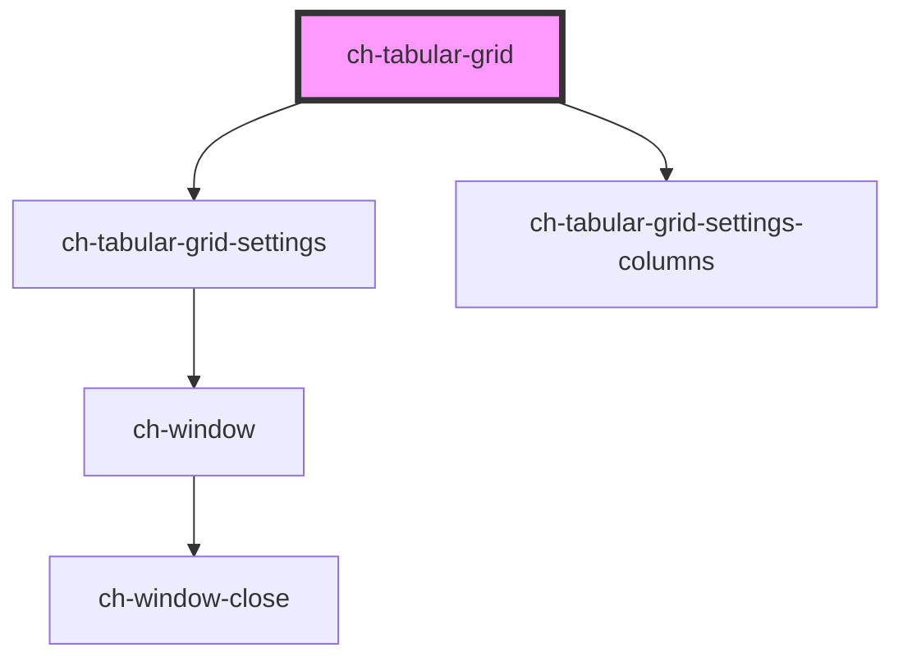

# ch-grid

<!-- Auto Generated Below -->

## Overview

The `ch-tabular-grid` component represents a Grid/TreeGrid of data, with rows and cells.

## Properties

| Property                 | Attribute                  | Description                                                                                                                                                                                                                                                                                           | Type                               | Default     |
| ------------------------ | -------------------------- | ----------------------------------------------------------------------------------------------------------------------------------------------------------------------------------------------------------------------------------------------------------------------------------------------------- | ---------------------------------- | ----------- |
| `allowColumnReorder`     | `allow-column-reorder`     | A boolean indicating whether the user can drag column headers to reorder columns.                                                                                                                                                                                                                     | `boolean`                          | `true`      |
| `columnResizeMode`       | `column-resize-mode`       | One of "single" or "splitter", indicating the behavior of column resizing. "single", resize a single column at a time. "splitter", when adjusts the width of one column, the neighboring columns    are also resized proportionally, maintaining the overall width.                                   | `"single" \| "splitter"`           | `"single"`  |
| `keyboardNavigationMode` | `keyboard-navigation-mode` | Specifies the keyboard navigation mode for the component. - "none": Disables keyboard navigation for the grid rows. - "select": Allows keyboard navigation by changing the selection of grid rows. - "focus": Allows keyboard navigation by focusing on grid rows, but does not change the selection. | `"focus" \| "none" \| "select"`    | `"select"`  |
| `localization`           | --                         | An object that contains localized strings for the grid.                                                                                                                                                                                                                                               | `GridLocalization`                 | `undefined` |
| `rowFocusedClass`        | `row-focused-class`        | A CSS class name applied to a row when it is focused.                                                                                                                                                                                                                                                 | `string`                           | `undefined` |
| `rowHighlightEnabled`    | `row-highlight-enabled`    | One of "false", "true" or "auto", indicating whether or not rows can be highlighted. "auto", row highlighting will be enabled if the row selection mode is set to "single" or "multiple".                                                                                                             | `"auto" \| boolean`                | `"auto"`    |
| `rowHighlightedClass`    | `row-highlighted-class`    | A CSS class name applied to a row when it is hovered.                                                                                                                                                                                                                                                 | `string`                           | `undefined` |
| `rowMarkedClass`         | `row-marked-class`         | A CSS class name applied to a row when it is marked.                                                                                                                                                                                                                                                  | `string`                           | `undefined` |
| `rowSelectedClass`       | `row-selected-class`       | A CSS class name applied to a row when it is selected.                                                                                                                                                                                                                                                | `string`                           | `undefined` |
| `rowSelectionMode`       | `row-selection-mode`       | One of "none", "single" or "multiple", indicating how rows can be selected. It can be set to "none" if no rows should be selectable, "single" if only one row can be selected at a time, or "multiple" if multiple rows can be selected at once.                                                      | `"multiple" \| "none" \| "single"` | `"single"`  |

## Events

| Event                  | Description                                                  | Type                                                |
| ---------------------- | ------------------------------------------------------------ | --------------------------------------------------- |
| `cellSelectionChanged` | Event emitted when the cell selection is changed.            | `CustomEvent<TabularGridCellSelectionChangedEvent>` |
| `rowClicked`           | Event emitted when a row is clicked.                         | `CustomEvent<TabularGridRowClickedEvent>`           |
| `rowContextMenu`       | Event emitted when attempts to open a context menu on a row. | `CustomEvent<TabularGridRowContextMenuEvent>`       |
| `rowDoubleClicked`     | Event emitted when a row is double clicked.                  | `CustomEvent<TabularGridRowClickedEvent>`           |
| `rowEnterPressed`      | Event emitted when Enter is pressed on a row.                | `CustomEvent<TabularGridRowPressedEvent>`           |
| `rowMarkingChanged`    | Event emitted when the row marking is changed.               | `CustomEvent<TabularGridMarkingChangedEvent>`       |
| `selectionChanged`     | Event emitted when the row selection is changed.             | `CustomEvent<TabularGridSelectionChangedEvent>`     |

## Methods

### `cellEnsureVisible(cellId: string) => Promise<void>`

Ensures that the cell is visible within the control, scrolling the contents of the control if necessary.

#### Parameters

| Name     | Type     | Description                                    |
| -------- | -------- | ---------------------------------------------- |
| `cellId` | `string` | - The cellId of the cell to ensure visibility. |

#### Returns

Type: `Promise<void>`

### `collapseRow(rowId: string) => Promise<void>`

Collapses a row, hiding its children.

#### Parameters

| Name    | Type     | Description                         |
| ------- | -------- | ----------------------------------- |
| `rowId` | `string` | - The rowId of the row to collapse. |

#### Returns

Type: `Promise<void>`

### `expandRow(rowId: string) => Promise<void>`

Expands a row, showing its children.

#### Parameters

| Name    | Type     | Description                       |
| ------- | -------- | --------------------------------- |
| `rowId` | `string` | - The rowId of the row to expand. |

#### Returns

Type: `Promise<void>`

### `getFocusedCell() => Promise<{ cellId: string; rowId: string; columnId: string; }>`

Retrieves information about the currently focused cell.

#### Returns

Type: `Promise<{ cellId: string; rowId: string; columnId: string; }>`

### `getFocusedRow() => Promise<string>`

Retrieves the rowId of the currently focused row.

#### Returns

Type: `Promise<string>`

### `getHoveredRow() => Promise<string>`

Retrieves the rowId of the currently hovered row.

#### Returns

Type: `Promise<string>`

### `getMarkedRows() => Promise<string[]>`

Retrieves the list of rowId of the marked rows.

#### Returns

Type: `Promise<string[]>`

### `getNextCell() => Promise<{ cellId: string; rowId: string; columnId: string; }>`

Retrieves information about the next cell relative to the currently selected cell.

#### Returns

Type: `Promise<{ cellId: string; rowId: string; columnId: string; }>`

### `getNextRow() => Promise<string | void>`

Retrieves the rowId of the next row relative to the currently selected cell.

#### Returns

Type: `Promise<string | void>`

### `getPreviousCell() => Promise<{ cellId: string; rowId: string; columnId: string; }>`

Retrieves information about the previous cell relative to the currently selected cell.

#### Returns

Type: `Promise<{ cellId: string; rowId: string; columnId: string; }>`

### `getPreviousRow() => Promise<string | void>`

Retrieves the rowId of the previous row relative to the currently selected cell.

#### Returns

Type: `Promise<string | void>`

### `getSelectedCell() => Promise<{ cellId: string; rowId: string; columnId: string; }>`

Retrieves information about the currently selected cell.

#### Returns

Type: `Promise<{ cellId: string; rowId: string; columnId: string; }>`

### `getSelectedRows() => Promise<string[]>`

Retrieves the list of rowId of the selected rows.

#### Returns

Type: `Promise<string[]>`

### `markAllRows(marked?: boolean) => Promise<void>`

Mark or unmark all rows.

#### Parameters

| Name     | Type      | Description                                                |
| -------- | --------- | ---------------------------------------------------------- |
| `marked` | `boolean` | - A boolean indicating whether to mark or unmark all rows. |

#### Returns

Type: `Promise<void>`

### `markRow(rowId: string, marked?: boolean) => Promise<void>`

Mark or unmark a row.

#### Parameters

| Name     | Type      | Description                                               |
| -------- | --------- | --------------------------------------------------------- |
| `rowId`  | `string`  | - The rowId of the row to select or deselect.             |
| `marked` | `boolean` | - A boolean indicating whether to mark or unmark the row. |

#### Returns

Type: `Promise<void>`

### `rowEnsureVisible(rowId: string) => Promise<void>`

Ensures that the row is visible within the control, scrolling the contents of the control if necessary.

#### Parameters

| Name    | Type     | Description                                  |
| ------- | -------- | -------------------------------------------- |
| `rowId` | `string` | - The rowId of the row to ensure visibility. |

#### Returns

Type: `Promise<void>`

### `selectAllRows(selected?: boolean) => Promise<void>`

Selects or deselects all rows.

#### Parameters

| Name       | Type      | Description                                                    |
| ---------- | --------- | -------------------------------------------------------------- |
| `selected` | `boolean` | - A boolean indicating whether to select or deselect all rows. |

#### Returns

Type: `Promise<void>`

### `selectCell(cellId?: string, rowId?: string, columnId?: string, selected?: boolean) => Promise<void>`

Select or deselect a cell.
The cell can be identified by the cellId parameter or
by using the rowId and columnId pair.

#### Parameters

| Name       | Type      | Description                                                    |
| ---------- | --------- | -------------------------------------------------------------- |
| `cellId`   | `string`  | - The cellId of the cell to select or deselect.                |
| `rowId`    | `string`  | - The rowId of the row containing the cell.                    |
| `columnId` | `string`  | - The columnId of the column containing the cell.              |
| `selected` | `boolean` | - A boolean indicating whether to select or deselect the cell. |

#### Returns

Type: `Promise<void>`

### `selectRow(rowId: string, selected?: boolean) => Promise<void>`

Selects or deselects a row.

#### Parameters

| Name       | Type      | Description                                                   |
| ---------- | --------- | ------------------------------------------------------------- |
| `rowId`    | `string`  | - The rowId of the row to select or deselect.                 |
| `selected` | `boolean` | - A boolean indicating whether to select or deselect the row. |

#### Returns

Type: `Promise<void>`

### `syncRowState(el: HTMLElement) => Promise<void>`

Synchronizes the state of a row in the grid.

#### Parameters

| Name | Type          | Description |
| ---- | ------------- | ----------- |
| `el` | `HTMLElement` |             |

#### Returns

Type: `Promise<void>`

## Shadow Parts

| Part                 | Description |
| -------------------- | ----------- |
| `"footer"`           |             |
| `"header"`           |             |
| `"main"`             |             |
| `"settings-columns"` |             |

## Dependencies

### Depends on

- [ch-tabular-grid-settings](settings)
- [ch-tabular-grid-settings-columns](./settings/columns)

### Graph

----------------------------------------------

*Built with [StencilJS](https://stenciljs.com/)*
