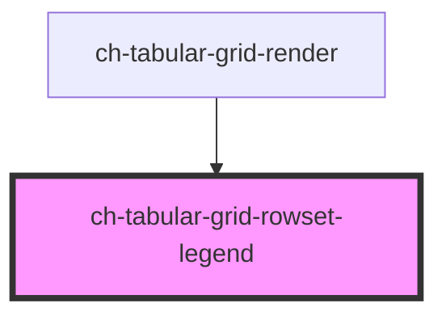

# ch-grid-rowset-legend

<!-- Auto Generated Below -->

## Overview

The `ch-tabular-grid-rowset-legend` component represents a caption for the `ch-tabular-grid-rowset` element.

## Properties

| Property | Attribute | Description                                                                                                                                                                                                                                                                | Type                | Default     |
| -------- | --------- | -------------------------------------------------------------------------------------------------------------------------------------------------------------------------------------------------------------------------------------------------------------------------- | ------------------- | ----------- |
| `parts`  | `parts`   | A boolean or string that controls the parts applied to the legend. - When `true`, it automatically applies the part names "column" and the column's unique ID. - When a string is provided, it appends that string to the default part names "column" and the column's ID. | `boolean \| string` | `undefined` |

## Events

| Event                 | Description                               | Type                            |
| --------------------- | ----------------------------------------- | ------------------------------- |
| `rowsetLegendClicked` | Event emitted when the legend is clicked. | `CustomEvent<CustomEvent<any>>` |

## Shadow Parts

| Part               | Description |
| ------------------ | ----------- |
| `"caret"`          |             |
| `"icon"`           |             |
| `"selector"`       |             |
| `"selector-label"` |             |

## Dependencies

### Used by

 - [ch-tabular-grid-render](../../../tabular-grid-render)

### Graph

----------------------------------------------

*Built with [StencilJS](https://stenciljs.com/)*
