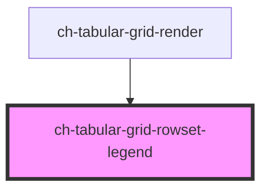

# ch-grid-rowset-legend

<!-- Auto Generated Below -->

## Overview

The `ch-tabular-grid-rowset-legend` component represents a caption for the `ch-tabular-grid-rowset` element.

## Events

| Event                 | Description                               | Type                            |
| --------------------- | ----------------------------------------- | ------------------------------- |
| `rowsetLegendClicked` | Event emitted when the legend is clicked. | `CustomEvent<CustomEvent<any>>` |

## Shadow Parts

| Part               | Description |
| ------------------ | ----------- |
| `"caret"`          |             |
| `"icon"`           |             |
| `"selector"`       |             |
| `"selector-label"` |             |

## Dependencies

### Used by

 - [ch-tabular-grid-render](../../../tabular-grid-render)

### Graph

----------------------------------------------

*Built with [StencilJS](https://stenciljs.com/)*
