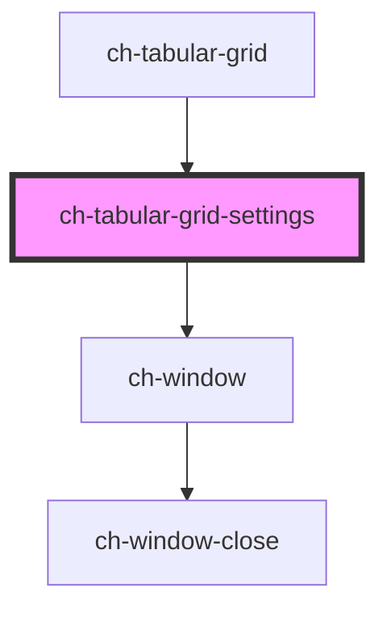

# ch-grid-settings

<!-- Auto Generated Below -->

## Overview

The `ch-tabular-grid-settings` component represents a settings window for a grid component.

## Properties

| Property            | Attribute | Description                                                                 | Type                       | Default     |
| ------------------- | --------- | --------------------------------------------------------------------------- | -------------------------- | ----------- |
| `grid` _(required)_ | `grid`    | The `HTMLChTabularGridElement` that the settings window is associated with. | `HTMLChTabularGridElement` | `undefined` |
| `show`              | `show`    | Indicates whether the settings window is currently shown or not.            | `boolean`                  | `false`     |

## Events

| Event                  | Description                                                            | Type               |
| ---------------------- | ---------------------------------------------------------------------- | ------------------ |
| `settingsCloseClicked` | Event emitted when the close button of the settings window is clicked. | `CustomEvent<any>` |

## Dependencies

### Used by

 - [ch-tabular-grid](..)

### Depends on

- [ch-window](../../../deprecated-components/window)

### Graph

----------------------------------------------

*Built with [StencilJS](https://stenciljs.com/)*
