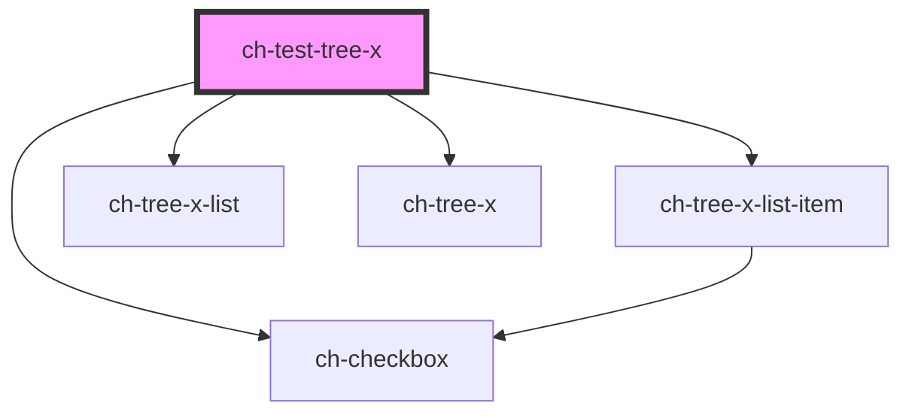

# ch-test-tree-x

<!-- Auto Generated Below -->

## Properties

| Property                    | Attribute         | Description                                                                                           | Type                                                                                     | Default         |
| --------------------------- | ----------------- | ----------------------------------------------------------------------------------------------------- | ---------------------------------------------------------------------------------------- | --------------- |
| `dropItemsCallback`         | --                | Callback that is executed when a list of items request to be dropped into another item.               | `(dropItemId: string, draggedIds: string[]) => Promise<TreeXItemModel[]>`                | `undefined`     |
| `lazyLoadTreeItemsCallback` | --                | Callback that is executed when a item request to load its subitems.                                   | `(treeItemId: string) => Promise<TreeXItemModel[]>`                                      | `undefined`     |
| `modifyItemCaptionCallback` | --                | Callback that is executed when a item request to modify its caption.                                  | `(treeItemId: string, newCaption: string) => Promise<TreeXOperationStatusModifyCaption>` | `undefined`     |
| `multiSelection`            | `multi-selection` | Set this attribute if you want to allow multi selection of the items.                                 | `boolean`                                                                                | `false`         |
| `showLines`                 | `show-lines`      | Set this attribute if you want to display the relation between tree items and tree lists using lines. | `boolean`                                                                                | `true`          |
| `sortItemsCallback`         | --                | Callback that is executed when the treeModel is changed to order its items.                           | `(subModel: TreeXItemModel[]) => void`                                                   | `undefined`     |
| `treeModel`                 | --                | This property lets you define the model of the ch-tree-x control.                                     | `{ items: TreeXItemModel[]; multiSelection?: boolean; showLines?: boolean; }`            | `{ items: [] }` |

## Methods

### `scrollIntoVisible(treeItemId: string) => Promise<void>`

Given an item id, it displays and scrolls into the item view.

#### Returns

Type: `Promise<void>`

## Dependencies

### Depends on

- [ch-tree-x-list-item](../tree-x-list-item)
- [ch-tree-x-list](../tree-x-list)
- [ch-tree-x](../tree-x)
- [ch-checkbox](../checkbox)

### Graph

----------------------------------------------

*Built with [StencilJS](https://stenciljs.com/)*
