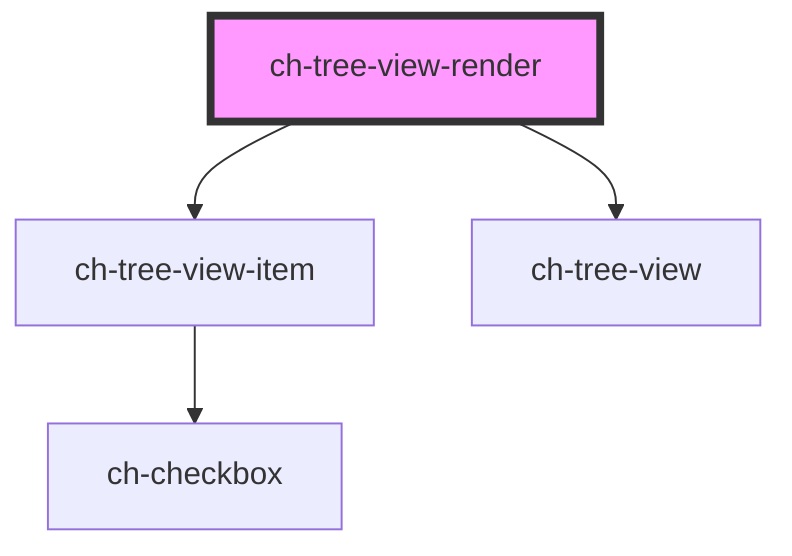

# ch-test-tree-x

<!-- Auto Generated Below -->

## Properties

| Property                     | Attribute           | Description                                                                                                                                                                                                                                                                                                                                                                                                                                                                                                                                                                                                                                                                                                                                                                                                                                                                                                                                                                                                                                                                                              | Type                                                                                                                                         | Default                        |
| ---------------------------- | ------------------- | -------------------------------------------------------------------------------------------------------------------------------------------------------------------------------------------------------------------------------------------------------------------------------------------------------------------------------------------------------------------------------------------------------------------------------------------------------------------------------------------------------------------------------------------------------------------------------------------------------------------------------------------------------------------------------------------------------------------------------------------------------------------------------------------------------------------------------------------------------------------------------------------------------------------------------------------------------------------------------------------------------------------------------------------------------------------------------------------------------- | -------------------------------------------------------------------------------------------------------------------------------------------- | ------------------------------ |
| `checkDroppableZoneCallback` | --                  | Callback that is executed when an element tries to drop in another item of the tree. Returns whether the drop is valid.                                                                                                                                                                                                                                                                                                                                                                                                                                                                                                                                                                                                                                                                                                                                                                                                                                                                                                                                                                                  | `(dropInformation: TreeXDropCheckInfo) => Promise<boolean>`                                                                                  | `undefined`                    |
| `checkbox`                   | `checkbox`          | Set this attribute if you want display a checkbox in all items by default.                                                                                                                                                                                                                                                                                                                                                                                                                                                                                                                                                                                                                                                                                                                                                                                                                                                                                                                                                                                                                               | `boolean`                                                                                                                                    | `false`                        |
| `checked`                    | `checked`           | Set this attribute if you want the checkbox to be checked in all items by default. Only works if `checkbox = true`                                                                                                                                                                                                                                                                                                                                                                                                                                                                                                                                                                                                                                                                                                                                                                                                                                                                                                                                                                                       | `boolean`                                                                                                                                    | `false`                        |
| `cssClass`                   | `css-class`         | A CSS class to set as the `ch-tree-x` element class.                                                                                                                                                                                                                                                                                                                                                                                                                                                                                                                                                                                                                                                                                                                                                                                                                                                                                                                                                                                                                                                     | `string`                                                                                                                                     | `undefined`                    |
| `dragDisabled`               | `drag-disabled`     | This attribute lets you specify if the drag operation is disabled in all items by default. If `true`, the items can't be dragged.                                                                                                                                                                                                                                                                                                                                                                                                                                                                                                                                                                                                                                                                                                                                                                                                                                                                                                                                                                        | `boolean`                                                                                                                                    | `DEFAULT_DRAG_DISABLED_VALUE`  |
| `dropDisabled`               | `drop-disabled`     | This attribute lets you specify if the drop operation is disabled in all items by default. If `true`, the items won't accept any drops.                                                                                                                                                                                                                                                                                                                                                                                                                                                                                                                                                                                                                                                                                                                                                                                                                                                                                                                                                                  | `boolean`                                                                                                                                    | `DEFAULT_DROP_DISABLED_VALUE`  |
| `dropItemsCallback`          | --                  | Callback that is executed when a list of items request to be dropped into another item.                                                                                                                                                                                                                                                                                                                                                                                                                                                                                                                                                                                                                                                                                                                                                                                                                                                                                                                                                                                                                  | `(dataTransferInfo: TreeXDataTransferInfo) => Promise<{ acceptDrop: boolean; items?: TreeXItemModel[]; }>`                                   | `undefined`                    |
| `editableItems`              | `editable-items`    | This attribute lets you specify if the edit operation is enabled in all items by default. If `true`, the items can edit its caption in place.                                                                                                                                                                                                                                                                                                                                                                                                                                                                                                                                                                                                                                                                                                                                                                                                                                                                                                                                                            | `boolean`                                                                                                                                    | `DEFAULT_EDITABLE_ITEMS_VALUE` |
| `filter`                     | `filter`            | This property lets you determine the expression that will be applied to the filter. Only works if `filterType = "caption" \| "metadata"`.                                                                                                                                                                                                                                                                                                                                                                                                                                                                                                                                                                                                                                                                                                                                                                                                                                                                                                                                                                | `string`                                                                                                                                     | `undefined`                    |
| `filterList`                 | --                  | This property lets you determine the list of items that will be filtered. Only works if `filterType = "id-list"`.                                                                                                                                                                                                                                                                                                                                                                                                                                                                                                                                                                                                                                                                                                                                                                                                                                                                                                                                                                                        | `string[]`                                                                                                                                   | `[]`                           |
| `filterOptions`              | --                  | This property lets you determine the options that will be applied to the filter. Only works if `filterType = "caption" \| "metadata"`.                                                                                                                                                                                                                                                                                                                                                                                                                                                                                                                                                                                                                                                                                                                                                                                                                                                                                                                                                                   | `{ autoExpand?: boolean; camelCase?: boolean; hideUnmatchedItems?: boolean; highlightMatchedItems?: boolean; regularExpression?: boolean; }` | `{}`                           |
| `filterType`                 | `filter-type`       | This attribute lets you define what kind of filter is applied to items. Only items that satisfy the filter predicate will be displayed.  \| Value       \| Details                                                                                        \| \| ----------- \| ---------------------------------------------------------------------------------------------- \| \| `checked`   \| Show only the items that have a checkbox and are checked.                                      \| \| `unchecked` \| Show only the items that have a checkbox and are not checked.                                  \| \| `caption`   \| Show only the items whose `caption` satisfies the regex determinate by the `filter` property.  \| \| `metadata`  \| Show only the items whose `metadata` satisfies the regex determinate by the `filter` property. \| \| `id-list`   \| Show only the items that are contained in the array determinate by the `filterList` property.  \| \| `none`      \| Show all items.                                                                                \| | `"caption" \| "checked" \| "id-list" \| "metadata" \| "none" \| "unchecked"`                                                                 | `"none"`                       |
| `lazyLoadTreeItemsCallback`  | --                  | Callback that is executed when a item request to load its subitems.                                                                                                                                                                                                                                                                                                                                                                                                                                                                                                                                                                                                                                                                                                                                                                                                                                                                                                                                                                                                                                      | `(treeItemId: string) => Promise<TreeXItemModel[]>`                                                                                          | `undefined`                    |
| `modifyItemCaptionCallback`  | --                  | Callback that is executed when a item request to modify its caption.                                                                                                                                                                                                                                                                                                                                                                                                                                                                                                                                                                                                                                                                                                                                                                                                                                                                                                                                                                                                                                     | `(treeItemId: string, newCaption: string) => Promise<TreeXOperationStatusModifyCaption>`                                                     | `undefined`                    |
| `multiSelection`             | `multi-selection`   | Set this attribute if you want to allow multi selection of the items.                                                                                                                                                                                                                                                                                                                                                                                                                                                                                                                                                                                                                                                                                                                                                                                                                                                                                                                                                                                                                                    | `boolean`                                                                                                                                    | `false`                        |
| `showLines`                  | `show-lines`        | `true` to display the relation between tree items and tree lists using lines.                                                                                                                                                                                                                                                                                                                                                                                                                                                                                                                                                                                                                                                                                                                                                                                                                                                                                                                                                                                                                            | `"all" \| "last" \| "none"`                                                                                                                  | `"none"`                       |
| `sortItemsCallback`          | --                  | Callback that is executed when the treeModel is changed to order its items.                                                                                                                                                                                                                                                                                                                                                                                                                                                                                                                                                                                                                                                                                                                                                                                                                                                                                                                                                                                                                              | `(subModel: TreeXItemModel[]) => void`                                                                                                       | `undefined`                    |
| `toggleCheckboxes`           | `toggle-checkboxes` | Set this attribute if you want all the children item's checkboxes to be checked when the parent item checkbox is checked, or to be unchecked when the parent item checkbox is unchecked. This attribute will be used in all items by default.                                                                                                                                                                                                                                                                                                                                                                                                                                                                                                                                                                                                                                                                                                                                                                                                                                                            | `boolean`                                                                                                                                    | `false`                        |
| `treeModel`                  | --                  | This property lets you define the model of the ch-tree-x control.                                                                                                                                                                                                                                                                                                                                                                                                                                                                                                                                                                                                                                                                                                                                                                                                                                                                                                                                                                                                                                        | `TreeXItemModel[]`                                                                                                                           | `[]`                           |

## Events

| Event                 | Description                                                                                              | Type                                                                                                                 |
| --------------------- | -------------------------------------------------------------------------------------------------------- | -------------------------------------------------------------------------------------------------------------------- |
| `checkedItemsChange`  | Fired when the checked items change. This event does not take into account the currently filtered items. | `CustomEvent<Map<string, TreeXItemModelExtended>>`                                                                   |
| `itemContextmenu`     | Fired when an element displays its contextmenu.                                                          | `CustomEvent<{ id: string; itemRef: HTMLChTreeViewItemElement; metadata: string; contextmenuEvent: PointerEvent; }>` |
| `itemOpenReference`   | Fired when the user interacts with an item in a way that its reference must be opened.                   | `CustomEvent<{ id: string; leaf: boolean; metadata: string; }>`                                                      |
| `selectedItemsChange` | Fired when the selected items change.                                                                    | `CustomEvent<Map<string, TreeXListItemSelectedInfo>>`                                                                |

## Methods

### `loadLazyContent(itemId: string, items?: TreeXItemModel[], downloading?: boolean, lazy?: boolean) => Promise<void>`

Given an item id, an array of items to add, the download status and the
lazy state, updates the item's UI Model.

#### Returns

Type: `Promise<void>`

### `scrollIntoVisible(treeItemId: string) => Promise<void>`

Given an item id, it displays and scrolls into the item view.

#### Returns

Type: `Promise<void>`

### `toggleItems(treeItemIds: string[], expand?: boolean) => Promise<TreeXListItemExpandedInfo[]>`

This method is used to toggle a tree item by the tree item id/ids.

#### Returns

Type: `Promise<TreeXListItemExpandedInfo[]>`

The modified items after the method was called.

### `updateAllItemsProperties(properties: { expanded?: boolean; checked?: boolean; }) => Promise<void>`

Given a subset of item's properties, it updates all item UI models.

#### Returns

Type: `Promise<void>`

### `updateItemsProperties(items: string[], properties: TreeXItemModel) => Promise<void>`

Given a item list and the properties to update, it updates the properties
of the items in the list.

#### Returns

Type: `Promise<void>`

### `updateValidDropZone(requestTimestamp: number, newContainerId: string, draggedItems: GxDataTransferInfo[], validDrop: boolean) => Promise<void>`

Update the information about the valid droppable zones.

#### Returns

Type: `Promise<void>`

## Dependencies

### Depends on

- [ch-tree-view-item](../tree-view/tree-view-item)
- [ch-tree-view](../tree-view/tree-view)

### Graph

----------------------------------------------

*Built with [StencilJS](https://stenciljs.com/)*
