# ch-test-flexible-layout

<!-- Auto Generated Below -->

## Properties

| Property                    | Attribute       | Description                                                     | Type                                                                         | Default     |
| --------------------------- | --------------- | --------------------------------------------------------------- | ---------------------------------------------------------------------------- | ----------- |
| `designSystem` _(required)_ | `design-system` | Specifies the design system used. Only for testing purposes.    | `"mercury" \| "unanimo"`                                                     | `undefined` |
| `model`                     | --              | Specifies the distribution of the items in the flexible layout. | `Omit<LayoutSplitterModel, "items"> & { items: FlexibleLayoutItemModel[]; }` | `layout3`   |

## Dependencies

### Depends on

- [ch-flexible-layout-render](../../flexible-layout)
- [ch-action-group-render](../../action-group)
- [ch-action-list-render](../../action-list)
- [ch-theme](../../theme)
- [ch-tree-view-render](../../tree-view)
- [ch-edit](../../edit)
- [ch-tabular-grid](../../tabular-grid)
- [ch-tabular-grid-columnset](../../tabular-grid/columnset)
- [ch-tabular-grid-column](../../tabular-grid/column)
- [ch-checkbox](../../checkbox)

### Graph

```mermaid
graph TD;
  ch-test-flexible-layout --> ch-flexible-layout-render
  ch-test-flexible-layout --> ch-action-group-render
  ch-test-flexible-layout --> ch-action-list-render
  ch-test-flexible-layout --> ch-theme
  ch-test-flexible-layout --> ch-tree-view-render
  ch-test-flexible-layout --> ch-edit
  ch-test-flexible-layout --> ch-tabular-grid
  ch-test-flexible-layout --> ch-tabular-grid-columnset
  ch-test-flexible-layout --> ch-tabular-grid-column
  ch-test-flexible-layout --> ch-checkbox
  ch-flexible-layout-render --> ch-theme
  ch-flexible-layout-render --> ch-flexible-layout
  ch-flexible-layout --> ch-tab-render
  ch-flexible-layout --> ch-layout-splitter
  ch-tab-render --> ch-textblock
  ch-action-group-render --> ch-action-menu-render
  ch-action-menu-render --> ch-action-menu
  ch-action-menu-render --> ch-popover
  ch-action-menu --> ch-popover
  ch-action-list-render --> ch-action-list-item
  ch-action-list-render --> ch-action-list-group
  ch-action-list-item --> ch-edit
  ch-tree-view-render --> ch-tree-view
  ch-tree-view-render --> ch-tree-view-drop
  ch-tree-view-render --> ch-tree-view-item
  ch-tree-view-item --> ch-checkbox
  ch-tabular-grid --> ch-tabular-grid-settings
  ch-tabular-grid --> ch-tabular-grid-settings-columns
  ch-tabular-grid-settings --> ch-window
  ch-window --> ch-window-close
  ch-tabular-grid-column --> ch-tabular-grid-column-settings
  ch-tabular-grid-column --> ch-tabular-grid-column-resize
  ch-tabular-grid-column-settings --> ch-window
  style ch-test-flexible-layout fill:#f9f,stroke:#333,stroke-width:4px
```

----------------------------------------------

*Built with [StencilJS](https://stenciljs.com/)*
