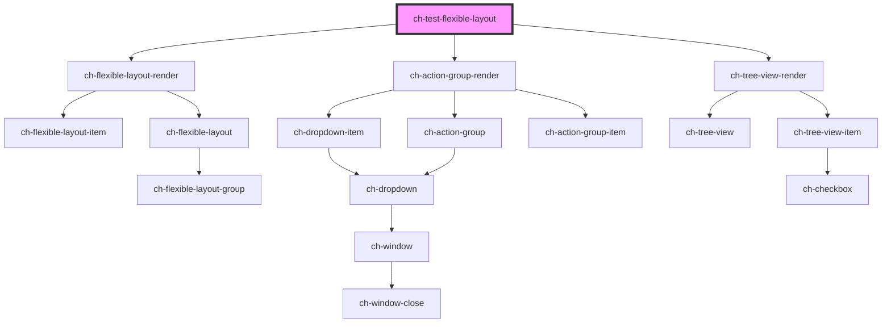

# ch-test-flexible-layout

<!-- Auto Generated Below -->

## Properties

| Property | Attribute | Description                                                     | Type                                                                                                                                                                                                                                                                                                     | Default         |
| -------- | --------- | --------------------------------------------------------------- | -------------------------------------------------------------------------------------------------------------------------------------------------------------------------------------------------------------------------------------------------------------------------------------------------------- | --------------- |
| `layout` | --        | Specifies the distribution of the items in the flexible layout. | `{ blockStart?: { items: FlexibleLayoutItemBase[]; }; inlineStart?: { expanded?: boolean; items: FlexibleLayoutItem[]; }; main?: { items: FlexibleLayoutItem[]; }; inlineEnd?: { expanded?: boolean; items: FlexibleLayoutItem[]; }; blockEnd?: { expanded?: boolean; items: FlexibleLayoutItem[]; }; }` | `defaultLayout` |

## Dependencies

### Depends on

- [ch-flexible-layout-render](../../renders/flexible-layout)
- [ch-action-group-render](../../renders/action-group)
- [ch-tree-view-render](../../renders/tree-view)

### Graph

----------------------------------------------

*Built with [StencilJS](https://stenciljs.com/)*
