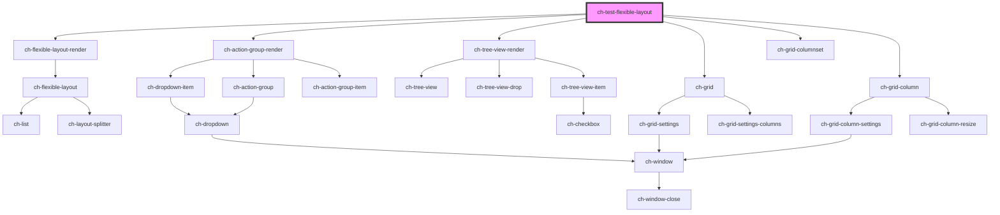

# ch-test-flexible-layout

<!-- Auto Generated Below -->

## Properties

| Property | Attribute | Description                                                     | Type                                                                           | Default   |
| -------- | --------- | --------------------------------------------------------------- | ------------------------------------------------------------------------------ | --------- |
| `layout` | --        | Specifies the distribution of the items in the flexible layout. | `Omit<LayoutSplitterDistribution, "items"> & { items: FlexibleLayoutItem[]; }` | `layout3` |

## Dependencies

### Depends on

- [ch-flexible-layout-render](../../renders/flexible-layout)
- [ch-action-group-render](../../renders/action-group)
- [ch-tree-view-render](../../renders/tree-view)
- [ch-grid](../../grid)
- [ch-grid-columnset](../../grid/grid-columnset)
- [ch-grid-column](../../grid/grid-column)

### Graph

----------------------------------------------

*Built with [StencilJS](https://stenciljs.com/)*
