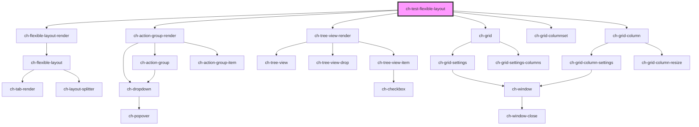

# ch-test-flexible-layout

<!-- Auto Generated Below -->

## Properties

| Property | Attribute | Description                                                     | Type                                                                         | Default   |
| -------- | --------- | --------------------------------------------------------------- | ---------------------------------------------------------------------------- | --------- |
| `model`  | --        | Specifies the distribution of the items in the flexible layout. | `Omit<LayoutSplitterModel, "items"> & { items: FlexibleLayoutItemModel[]; }` | `layout3` |

## Dependencies

### Depends on

- [ch-flexible-layout-render](../../flexible-layout)
- [ch-action-group-render](../../action-group)
- [ch-tree-view-render](../../tree-view)
- [ch-grid](../../grid)
- [ch-grid-columnset](../../grid/grid-columnset)
- [ch-grid-column](../../grid/grid-column)

### Graph

----------------------------------------------

*Built with [StencilJS](https://stenciljs.com/)*
