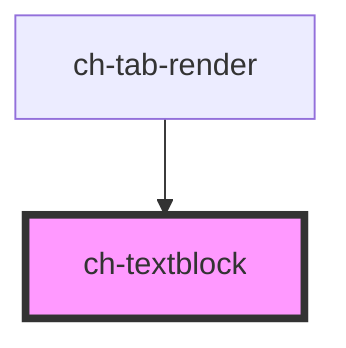

# ch-textblock

<!-- Auto Generated Below -->

## Overview

The `ch-textblock` component displays text or HTML content with multi-line
ellipsis truncation, automatic grow behavior, and overflow detection.

## Features
 - Multi-line ellipsis truncation with automatic line calculation.
 - Auto-grow mode that expands the container to fit its content.
 - Overflow detection with an `overflowingContentChange` event.
 - Semantic role mapping (paragraph or heading levels h1-h6).
 - Optional native tooltip on content overflow.

## Use when
 - You need a text container that intelligently handles overflow across multiple lines.
 - Displaying dynamic text that may overflow and requires a tooltip or line-clamping.
 - Content needs a semantic heading role (`h1`–`h6`) without using native heading elements.

## Do not use when
 - You need to render rich Markdown content — prefer `ch-markdown-viewer` instead.
 - Rich Markdown or HTML formatting is needed — prefer `ch-markdown-viewer`.
 - Static text that never overflows — a plain HTML element is more appropriate.

## Accessibility
 - Supports configurable semantic role via `accessibleRole`: `"paragraph"`, `"heading"` (with `aria-level`), or `"none"`.
 - When content overflows and `showTooltipOnOverflow` is `true`, a `title` attribute provides the full text to assistive technology.
## Properties

| Property                       | Attribute                          | Description                                                                                                                                                                                                                                                                                                                     | Type                                                  | Default     |
| ------------------------------ | ---------------------------------- | ------------------------------------------------------------------------------------------------------------------------------------------------------------------------------------------------------------------------------------------------------------------------------------------------------------------------------- | ----------------------------------------------------- | ----------- |
| `accessibleRole`               | `accessible-role`                  | Specifies the accessible role of the component, which improves the semantic that the component models.                                                                                                                                                                                                                          | `"h1" \| "h2" \| "h3" \| "h4" \| "h5" \| "h6" \| "p"` | `"p"`       |
| `autoGrow`                     | `auto-grow`                        | This property defines if the control size will grow automatically, to adjust to its content size.  If `false` the overflowing content will be displayed with an ellipsis. This ellipsis takes into account multiple lines.                                                                                                      | `boolean`                                             | `false`     |
| `caption`                      | `caption`                          | Specifies the content to be displayed when the control has `format = text`.                                                                                                                                                                                                                                                     | `string`                                              | `undefined` |
| `characterToMeasureLineHeight` | `character-to-measure-line-height` | Specifies the character used to measure the line height                                                                                                                                                                                                                                                                         | `string`                                              | `"A"`       |
| `format`                       | `format`                           | It specifies the format that will have the textblock control.   - If `format` = `HTML`, the textblock control works as an HTML div and    the innerHTML will be taken from the default slot.   - If `format` = `text`, the control works as a normal textblock control    and it is affected by most of the defined properties. | `"HTML" \| "text"`                                    | `"text"`    |
| `showTooltipOnOverflow`        | `show-tooltip-on-overflow`         | `true` to display a tooltip when the caption overflows the size of the container.  Only works if `format = text` and `autoGrow = false`.                                                                                                                                                                                        | `boolean`                                             | `false`     |

## Events

| Event                      | Description                                                                                                           | Type                   |
| -------------------------- | --------------------------------------------------------------------------------------------------------------------- | ---------------------- |
| `overflowingContentChange` | Fired when the displayed lines overflows the control's content. If `true`, the current content overflows the control. | `CustomEvent<boolean>` |

## Slots

| Slot | Description                                                                   |
| ---- | ----------------------------------------------------------------------------- |
|      | The default slot for HTML content. Rendered when `format` is set to `"HTML"`. |

## Dependencies

### Used by

 - [ch-tab-render](../tab)

### Graph

```mermaid
graph TD;
  ch-tab-render --> ch-textblock
  style ch-textblock fill:#f9f,stroke:#333,stroke-width:4px
```

----------------------------------------------

*Built with [StencilJS](https://stenciljs.com/)*
