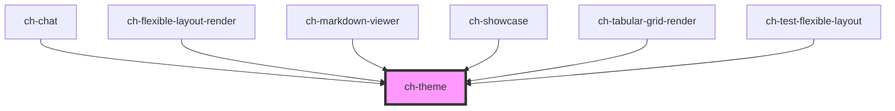

# ch-theme

## Table of Contents

- [Overview](#overview)
- [Features](#features)
- [Use when](#use-when)
- [Do not use when](#do-not-use-when)
- [Accessibility](#accessibility)
- [Properties](#properties)
- [Events](#events)
- [Dependencies](#dependencies)
  - [Used by](#used-by)
  - [Graph](#graph)

<!-- Auto Generated Below -->

## Overview

The `ch-theme` component loads and manages named stylesheets that can be shared and reused across the Document or any Shadow Root via the `adoptedStyleSheets` API.

## Features
 - Themes specified by name (resolved from a registry), by URL, or as inline `CSSStyleSheet` instances.
 - Configurable loading timeout with `Promise.allSettled` — partial failures do not block other themes from loading.
 - Automatic attachment and detachment of stylesheets on connect/disconnect.
 - Built-in flash-of-unstyled-content (FOUC) prevention that hides the host until themes finish loading.
 - Toggle stylesheet attachment via the `attachStyleSheets` property.
 - Attaches to the nearest `Document` or `ShadowRoot` via `adoptedStyleSheets`, enabling cross-component theme sharing.

## Use when
 - Applying shared design tokens or theme stylesheets across components.
 - Loading external CSS themes by URL at runtime.
 - Loading one or more CSS theme files lazily at runtime (e.g., dark mode, brand themes, component skins).
 - Preventing flash of unstyled content before themes are applied.

## Do not use when
 - Styling a single component with scoped CSS — use the component's own `styleUrl` instead.
 - Styles can be included as a static stylesheet link at build time — no runtime loading needed.

## Accessibility
 - The host element is hidden (`hidden` attribute) and does not render visible content. It is a purely structural theming component.

## Properties

| Property                      | Attribute                         | Description                                                                                                                                                                                                                                                                                                                                                                                                                                                                                         | Type                                                                                                                               | Default     |
| ----------------------------- | --------------------------------- | --------------------------------------------------------------------------------------------------------------------------------------------------------------------------------------------------------------------------------------------------------------------------------------------------------------------------------------------------------------------------------------------------------------------------------------------------------------------------------------------------- | ---------------------------------------------------------------------------------------------------------------------------------- | ----------- |
| `attachStyleSheets`           | `attach-style-sheets`             | Indicates whether the theme should be attached to the Document or the ShadowRoot after loading. The value can be overridden by the `attachStyleSheet` property of each individual item in the model. When toggled at runtime, already-loaded themes are attached or detached accordingly without re-fetching.                                                                                                                                                                                       | `boolean`                                                                                                                          | `true`      |
| `avoidFlashOfUnstyledContent` | `avoid-flash-of-unstyled-content` | `true` to visually hide the contents of the root node while the control's style is not loaded. When enabled, a `<style>` element with `visibility: hidden !important` is rendered into the host until all themes resolve. Set to `false` if the initial unstyled flash is acceptable or if the themes are expected to be cached.                                                                                                                                                                    | `boolean`                                                                                                                          | `true`      |
| `model`                       | `model`                           | Specifies the themes to load. Accepts a single theme name (string), an array of theme names, a single `ThemeItemModel` object, or an array of `ThemeItemModel` objects. Each item may specify a `name`, `url`, `styleSheet`, `themeBaseUrl`, and per-item `attachStyleSheet` override.  When set to `undefined` or `null`, no themes are loaded.  **Note:** The model is only processed on the first non-null assignment. Subsequent changes to an already-loaded model are currently not reactive. | `ThemeItemBaseModel & { styleSheet: string; } \| ThemeItemBaseModel & { url?: string; } \| ThemeItemModel[] \| string \| string[]` | `undefined` |
| `timeout`                     | `timeout`                         | Specifies the maximum time (in milliseconds) to wait for each requested theme to load. If a theme does not resolve within this window, it is treated as a rejected promise and logged to the console.  Defaults to `10000` (10 seconds). This is an init-only property; changing it after the initial load has no effect.                                                                                                                                                                           | `10000`                                                                                                                            | `10000`     |

## Events

| Event         | Description                                                                                                                                                                                                                                                                                                                                               | Type                              |
| ------------- | --------------------------------------------------------------------------------------------------------------------------------------------------------------------------------------------------------------------------------------------------------------------------------------------------------------------------------------------------------- | --------------------------------- |
| `themeLoaded` | Emitted after all theme loading promises have settled (via `Promise.allSettled`). The event payload contains a `success` array with the names of the themes that loaded successfully. Themes that failed are logged to the console but not included in the payload.  Bubbles: `true`. Composed: `false` — the event does not cross shadow DOM boundaries. | `CustomEvent<ChThemeLoadedEvent>` |

## Dependencies

### Used by

 - [ch-chat](../chat)
 - [ch-flexible-layout-render](../flexible-layout)
 - [ch-markdown-viewer](../markdown-viewer)
 - [ch-showcase](../../showcase/assets/components)
 - [ch-tabular-grid-render](../tabular-grid-render)
 - [ch-test-flexible-layout](../test/test-flexible-layout)

### Graph

```mermaid
graph TD;
  ch-chat --> ch-theme
  ch-flexible-layout-render --> ch-theme
  ch-markdown-viewer --> ch-theme
  ch-showcase --> ch-theme
  ch-tabular-grid-render --> ch-theme
  ch-test-flexible-layout --> ch-theme
  style ch-theme fill:#f9f,stroke:#333,stroke-width:4px
```

----------------------------------------------

*Built with [StencilJS](https://stenciljs.com/)*
