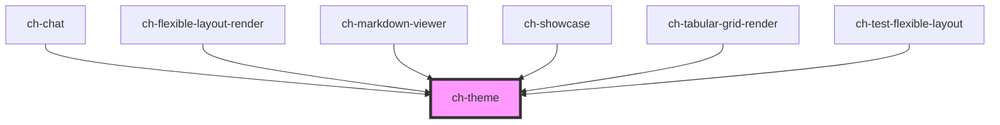

# ch-theme

<!-- Auto Generated Below -->

## Overview

The `ch-theme` component loads and manages named stylesheets that can be shared and reused across the Document or any Shadow Root via the `adoptedStyleSheets` API.

## Features
 - Themes specified by name (resolved from a registry), by URL, or as inline `CSSStyleSheet` instances.
 - Configurable loading timeout.
 - Automatic attachment and detachment of stylesheets on connect/disconnect.
 - Built-in flash-of-unstyled-content (FOUC) prevention that hides the host until themes finish loading.
 - Toggle stylesheet attachment via the `attachStyleSheets` property.

## Use when
 - Applying shared design tokens or theme stylesheets across components.
 - Loading external CSS themes by URL at runtime.
 - Loading one or more CSS theme files lazily at runtime (e.g., dark mode, brand themes, component skins).
 - Preventing flash of unstyled content before themes are applied.

## Do not use when
 - Styling a single component with scoped CSS — use the component's own `styleUrl` instead.
 - Styles can be included as a static stylesheet link at build time — no runtime loading needed.

## Properties

| Property                      | Attribute                         | Description                                                                                                                                                                  | Type                                                                                                                               | Default     |
| ----------------------------- | --------------------------------- | ---------------------------------------------------------------------------------------------------------------------------------------------------------------------------- | ---------------------------------------------------------------------------------------------------------------------------------- | ----------- |
| `attachStyleSheets`           | `attach-style-sheets`             | Indicates whether the theme should be attached to the Document or the ShadowRoot after loading. The value can be overridden by the `attachStyleSheet` property of the model. | `boolean`                                                                                                                          | `true`      |
| `avoidFlashOfUnstyledContent` | `avoid-flash-of-unstyled-content` | `true` to visually hide the contents of the root node while the control's style is not loaded.                                                                               | `boolean`                                                                                                                          | `true`      |
| `model`                       | `model`                           | Specify themes to load                                                                                                                                                       | `ThemeItemBaseModel & { styleSheet: string; } \| ThemeItemBaseModel & { url?: string; } \| ThemeItemModel[] \| string \| string[]` | `undefined` |
| `timeout`                     | `timeout`                         | Specifies the time to wait for the requested theme to load.                                                                                                                  | `10000`                                                                                                                            | `10000`     |

## Events

| Event         | Description                                          | Type                              |
| ------------- | ---------------------------------------------------- | --------------------------------- |
| `themeLoaded` | Event emitted when the theme has successfully loaded | `CustomEvent<ChThemeLoadedEvent>` |

## Dependencies

### Used by

 - [ch-chat](../chat)
 - [ch-flexible-layout-render](../flexible-layout)
 - [ch-markdown-viewer](../markdown-viewer)
 - [ch-showcase](../../showcase/assets/components)
 - [ch-tabular-grid-render](../tabular-grid-render)
 - [ch-test-flexible-layout](../test/test-flexible-layout)

### Graph

```mermaid
graph TD;
  ch-chat --> ch-theme
  ch-flexible-layout-render --> ch-theme
  ch-markdown-viewer --> ch-theme
  ch-showcase --> ch-theme
  ch-tabular-grid-render --> ch-theme
  ch-test-flexible-layout --> ch-theme
  style ch-theme fill:#f9f,stroke:#333,stroke-width:4px
```

----------------------------------------------

*Built with [StencilJS](https://stenciljs.com/)*
