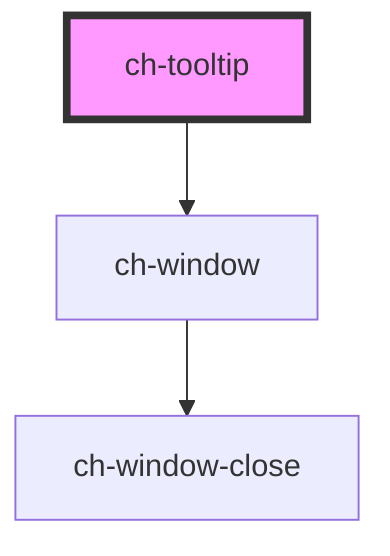

# ch-tooltip

<!-- Auto Generated Below -->

## Properties

| Property    | Attribute    | Description                                                              | Type                                                                                                                                                                                                                                                                                                                                                                                                                                               | Default                 |
| ----------- | ------------ | ------------------------------------------------------------------------ | -------------------------------------------------------------------------------------------------------------------------------------------------------------------------------------------------------------------------------------------------------------------------------------------------------------------------------------------------------------------------------------------------------------------------------------------------- | ----------------------- |
| `delay`     | `delay`      | Specifies the delay (in ms) for the tooltip to be displayed.             | `number`                                                                                                                                                                                                                                                                                                                                                                                                                                           | `100`                   |
| `position`  | `position`   | Specifies the position of the tooltip relative to the container element. | `"Center_OutsideEnd" \| "Center_OutsideStart" \| "InsideEnd_OutsideEnd" \| "InsideEnd_OutsideStart" \| "InsideStart_OutsideEnd" \| "InsideStart_OutsideStart" \| "OutsideEnd_Center" \| "OutsideEnd_InsideEnd" \| "OutsideEnd_InsideStart" \| "OutsideEnd_OutsideEnd" \| "OutsideEnd_OutsideStart" \| "OutsideStart_Center" \| "OutsideStart_InsideEnd" \| "OutsideStart_InsideStart" \| "OutsideStart_OutsideEnd" \| "OutsideStart_OutsideStart"` | `"OutsideStart_Center"` |
| `tooltipId` | `tooltip-id` | Specifies the tooltip description.                                       | `string`                                                                                                                                                                                                                                                                                                                                                                                                                                           | `"Tooltip"`             |

## Dependencies

### Depends on

- [ch-window](../window)

### Graph

----------------------------------------------

*Built with [StencilJS](https://stenciljs.com/)*
