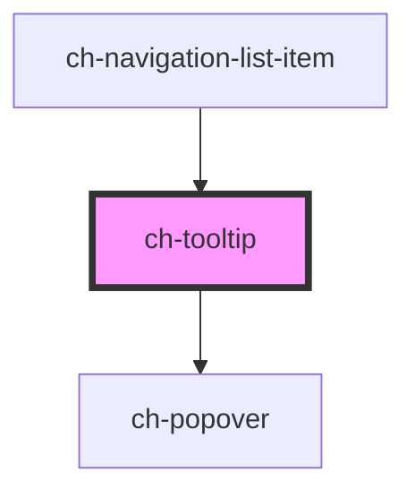

# ch-tooltip

<!-- Auto Generated Below -->

## Properties

| Property        | Attribute      | Description                                                                                                                                                                                                                                                        | Type                                                                             | Default         |
| --------------- | -------------- | ------------------------------------------------------------------------------------------------------------------------------------------------------------------------------------------------------------------------------------------------------------------ | -------------------------------------------------------------------------------- | --------------- |
| `actionElement` | --             | Specifies a reference for the action that opens the tooltip.  If `undefined`, a button on the tooltip will be rendered and the slot "action" can be used to display the content of the action.  If `null`, the parentElement will be used as the action reference. | `HTMLButtonElement`                                                              | `undefined`     |
| `blockAlign`    | `block-align`  | Specifies the block alignment of the window.                                                                                                                                                                                                                       | `"center" \| "inside-end" \| "inside-start" \| "outside-end" \| "outside-start"` | `"outside-end"` |
| `delay`         | `delay`        | Specifies the delay (in ms) for the tooltip to be displayed.                                                                                                                                                                                                       | `number`                                                                         | `100`           |
| `inlineAlign`   | `inline-align` | Specifies the inline alignment of the window.                                                                                                                                                                                                                      | `"center" \| "inside-end" \| "inside-start" \| "outside-end" \| "outside-start"` | `"center"`      |

## Shadow Parts

| Part       | Description |
| ---------- | ----------- |
| `"action"` |             |
| `"window"` |             |

## CSS Custom Properties

| Name                        | Description                                                                                                                |
| --------------------------- | -------------------------------------------------------------------------------------------------------------------------- |
| `--ch-tooltip-separation`   | Specifies the separation between the action and the displayed tooltip. @default 0px                                        |
| `--ch-tooltip-separation-x` | Specifies the separation between the action and the tooltip displayed on the x-axis. @default var(--ch-tooltip-separation) |
| `--ch-tooltip-separation-y` | Specifies the separation between the action and the tooltip displayed on the y-axis. @default var(--ch-tooltip-separation) |

## Dependencies

### Used by

 - [ch-navigation-list-item](../navigation-list/internal/navigation-list-item)

### Depends on

- [ch-popover](../popover)

### Graph

----------------------------------------------

*Built with [StencilJS](https://stenciljs.com/)*
