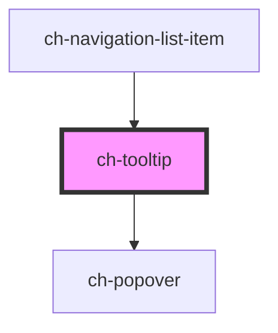

# ch-tooltip

<!-- Auto Generated Below -->

## Overview

The `ch-tooltip` component displays supplementary information in a small
overlay that appears on hover or focus of a trigger element, following the
WAI-ARIA tooltip pattern.

## Properties

| Property                      | Attribute                        | Description                                                                                                                                                                                                                                                        | Type                                                                             | Default         |
| ----------------------------- | -------------------------------- | ------------------------------------------------------------------------------------------------------------------------------------------------------------------------------------------------------------------------------------------------------------------ | -------------------------------------------------------------------------------- | --------------- |
| `actionElement`               | --                               | Specifies a reference for the action that opens the tooltip.  If `undefined`, a button on the tooltip will be rendered and the slot "action" can be used to display the content of the action.  If `null`, the parentElement will be used as the action reference. | `HTMLButtonElement`                                                              | `undefined`     |
| `actionElementAccessibleName` | `action-element-accessible-name` | Specifies a short string, typically 1 to 3 words, that authors associate with an element to provide users of assistive technologies with a label for the actionElement. This property is necessary to provide a label when the tooltip is not displayed.           | `string`                                                                         | `undefined`     |
| `blockAlign`                  | `block-align`                    | Specifies the block alignment of the window.                                                                                                                                                                                                                       | `"center" \| "inside-end" \| "inside-start" \| "outside-end" \| "outside-start"` | `"outside-end"` |
| `delay`                       | `delay`                          | Specifies the delay (in ms) for the tooltip to be displayed.                                                                                                                                                                                                       | `number`                                                                         | `100`           |
| `inlineAlign`                 | `inline-align`                   | Specifies the inline alignment of the window.                                                                                                                                                                                                                      | `"center" \| "inside-end" \| "inside-start" \| "outside-end" \| "outside-start"` | `"center"`      |

## Slots

| Slot       | Description                                                                                         |
| ---------- | --------------------------------------------------------------------------------------------------- |
|            | Default slot. The tooltip content displayed inside the popover window.                              |
| `"action"` | Content projected inside the internal trigger button. Rendered when `actionElement` is `undefined`. |

## Shadow Parts

| Part       | Description                                                                                                                                                           |
| ---------- | --------------------------------------------------------------------------------------------------------------------------------------------------------------------- |
| `"action"` | The internally rendered `<button>` that acts as the tooltip trigger. Only present when `actionElement` is `undefined` (i.e., the action lives inside the shadow DOM). |
| `"window"` | The `ch-popover` element that contains the tooltip content. Only present while the tooltip is visible.                                                                |

## CSS Custom Properties

| Name                        | Description                                                                                                                |
| --------------------------- | -------------------------------------------------------------------------------------------------------------------------- |
| `--ch-tooltip-separation`   | Specifies the separation between the action and the displayed tooltip. @default 0px                                        |
| `--ch-tooltip-separation-x` | Specifies the separation between the action and the tooltip displayed on the x-axis. @default var(--ch-tooltip-separation) |
| `--ch-tooltip-separation-y` | Specifies the separation between the action and the tooltip displayed on the y-axis. @default var(--ch-tooltip-separation) |

## Dependencies

### Used by

 - [ch-navigation-list-item](../navigation-list/internal/navigation-list-item)

### Depends on

- [ch-popover](../popover)

### Graph

```mermaid
graph TD;
  ch-tooltip --> ch-popover
  ch-navigation-list-item --> ch-tooltip
  style ch-tooltip fill:#f9f,stroke:#333,stroke-width:4px
```

----------------------------------------------

*Built with [StencilJS](https://stenciljs.com/)*
