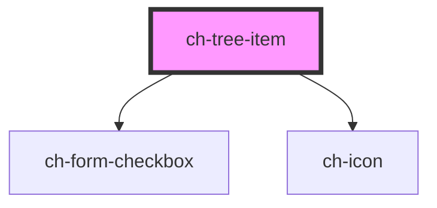

# ch-tree-item

<!-- Auto Generated Below -->

## Properties

| Property         | Attribute          | Description                                                                                                                    | Type      | Default     |
| ---------------- | ------------------ | ------------------------------------------------------------------------------------------------------------------------------ | --------- | ----------- |
| `checkbox`       | `checkbox`         | Set this attribute if you want the ch-tree-item to display a checkbox                                                          | `boolean` | `false`     |
| `checked`        | `checked`          | Set this attribute if you want the ch-tree-item checkbox to be checked by default                                              | `boolean` | `false`     |
| `disabled`       | `disabled`         |                                                                                                                                | `boolean` | `false`     |
| `download`       | `download`         | Set this attribute if this tree-item has a resource to be downloaded;                                                          | `boolean` | `false`     |
| `downloaded`     | `downloaded`       | Set this attribute when you have downloaded the resource                                                                       | `boolean` | `false`     |
| `downloading`    | `downloading`      | Set this attribute when you are downloading a resource                                                                         | `boolean` | `false`     |
| `firstTreeItem`  | `first-tree-item`  |                                                                                                                                | `boolean` | `false`     |
| `hasChildTree`   | `has-child-tree`   |                                                                                                                                | `boolean` | `false`     |
| `indeterminate`  | `indeterminate`    |                                                                                                                                | `boolean` | `undefined` |
| `isLeaf`         | `is-leaf`          | The presence of this attribute displays a +/- icon to toggle/untoggle the tree                                                 | `boolean` | `undefined` |
| `leftIcon`       | `left-icon`        | Set the left side icon from the available Gemini icon set : https://gx-gemini.netlify.app/?path=/story/icons-icons--controls   | `string`  | `undefined` |
| `leftIconClass`  | `left-icon-class`  | Set the left side icon part class name                                                                                         | `string`  | `undefined` |
| `opened`         | `opened`           | If this tree-item has a nested tree, set this attribute to make the tree open by default                                       | `boolean` | `false`     |
| `rightIcon`      | `right-icon`       | Set thhe right side icon from the available Gemini icon set : https://gx-gemini.netlify.app/?path=/story/icons-icons--controls | `string`  | `undefined` |
| `rightIconClass` | `right-icon-class` | Set the right side icon part class name                                                                                        | `string`  | `undefined` |
| `selected`       | `selected`         | The presence of this attribute sets the tree-item as selected                                                                  | `boolean` | `false`     |

## Events

| Event                  | Description | Type               |
| ---------------------- | ----------- | ------------------ |
| `checkboxClickedEvent` |             | `CustomEvent<any>` |
| `liItemClicked`        |             | `CustomEvent<any>` |
| `toggleIconClicked`    |             | `CustomEvent<any>` |

## Methods

### `updateTreeVerticalLineHeight() => Promise<void>`

#### Returns

Type: `Promise<void>`

## Shadow Parts

| Part           | Description |
| -------------- | ----------- |
| `"checkbox"`   |             |
| `"left-icon"`  |             |
| `"right-icon"` |             |

## Dependencies

### Depends on

- [ch-form-checkbox](../form-checkbox)
- [ch-icon](../icon)

### Graph

----------------------------------------------

*Built with [StencilJS](https://stenciljs.com/)*
