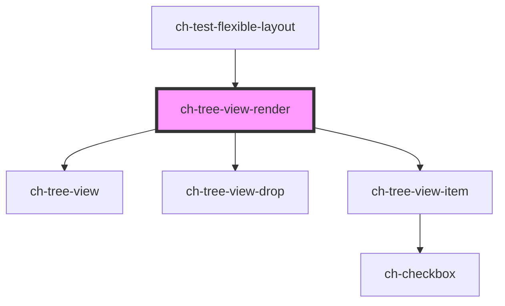

# ch-tree-view-render

<!-- Auto Generated Below -->

## Properties

| Property                     | Attribute           | Description                                                                                                                                                                                                                                                                                                                                                                                                                                                                                                                                                                                                                                                                                                                                                                                                                                                                                                                                                                                                                                                                                              | Type                                                                                                                                                                        | Default                    |
| ---------------------------- | ------------------- | -------------------------------------------------------------------------------------------------------------------------------------------------------------------------------------------------------------------------------------------------------------------------------------------------------------------------------------------------------------------------------------------------------------------------------------------------------------------------------------------------------------------------------------------------------------------------------------------------------------------------------------------------------------------------------------------------------------------------------------------------------------------------------------------------------------------------------------------------------------------------------------------------------------------------------------------------------------------------------------------------------------------------------------------------------------------------------------------------------- | --------------------------------------------------------------------------------------------------------------------------------------------------------------------------- | -------------------------- |
| `checkDroppableZoneCallback` | --                  | Callback that is executed when an element tries to drop in another item of the tree. Returns whether the drop is valid.                                                                                                                                                                                                                                                                                                                                                                                                                                                                                                                                                                                                                                                                                                                                                                                                                                                                                                                                                                                  | `(dropInformation: TreeViewDropCheckInfo) => Promise<boolean>`                                                                                                              | `undefined`                |
| `checkbox`                   | `checkbox`          | Set this attribute if you want display a checkbox in all items by default.                                                                                                                                                                                                                                                                                                                                                                                                                                                                                                                                                                                                                                                                                                                                                                                                                                                                                                                                                                                                                               | `boolean`                                                                                                                                                                   | `false`                    |
| `checked`                    | `checked`           | Set this attribute if you want the checkbox to be checked in all items by default. Only works if `checkbox = true`                                                                                                                                                                                                                                                                                                                                                                                                                                                                                                                                                                                                                                                                                                                                                                                                                                                                                                                                                                                       | `boolean`                                                                                                                                                                   | `false`                    |
| `dragDisabled`               | `drag-disabled`     | This attribute lets you specify if the drag operation is disabled in all items by default. If `true`, the items can't be dragged.                                                                                                                                                                                                                                                                                                                                                                                                                                                                                                                                                                                                                                                                                                                                                                                                                                                                                                                                                                        | `boolean`                                                                                                                                                                   | `true`                     |
| `dropDisabled`               | `drop-disabled`     | This attribute lets you specify if the drop operation is disabled in all items by default. If `true`, the items won't accept any drops.                                                                                                                                                                                                                                                                                                                                                                                                                                                                                                                                                                                                                                                                                                                                                                                                                                                                                                                                                                  | `boolean`                                                                                                                                                                   | `true`                     |
| `dropItemsCallback`          | --                  | Callback that is executed when a list of items request to be dropped into another item.                                                                                                                                                                                                                                                                                                                                                                                                                                                                                                                                                                                                                                                                                                                                                                                                                                                                                                                                                                                                                  | `(dataTransferInfo: TreeViewDataTransferInfo) => Promise<{ acceptDrop: boolean; model?: TreeViewModel; }>`                                                                  | `undefined`                |
| `dropMode`                   | `drop-mode`         | This attribute lets you specify which kind of drop operation can be effected in the items.                                                                                                                                                                                                                                                                                                                                                                                                                                                                                                                                                                                                                                                                                                                                                                                                                                                                                                                                                                                                               | `"above" \| "all" \| "before-and-after"`                                                                                                                                    | `"above"`                  |
| `editableItems`              | `editable-items`    | This attribute lets you specify if the edit operation is enabled in all items by default. If `true`, the items can edit its caption in place.                                                                                                                                                                                                                                                                                                                                                                                                                                                                                                                                                                                                                                                                                                                                                                                                                                                                                                                                                            | `boolean`                                                                                                                                                                   | `false`                    |
| `expandOnClick`              | `expand-on-click`   | Specifies if a tree-view-item is expanded on click interaction. If `true` the tree-view-item is expanded on click interaction. If `false`, with mouse interaction the tree-view-item will only be expanded on double click.                                                                                                                                                                                                                                                                                                                                                                                                                                                                                                                                                                                                                                                                                                                                                                                                                                                                              | `boolean`                                                                                                                                                                   | `true`                     |
| `expandableButton`           | `expandable-button` | Specifies what kind of expandable button is displayed in the items by default.  - `"expandableButton"`: Expandable button that allows to expand/collapse     the items of the control.  - `"decorative"`: Only a decorative icon is rendered to display the state     of the item.                                                                                                                                                                                                                                                                                                                                                                                                                                                                                                                                                                                                                                                                                                                                                                                                                       | `"action" \| "decorative" \| "no"`                                                                                                                                          | `"decorative"`             |
| `filter`                     | `filter`            | This property lets you determine the expression that will be applied to the filter. Only works if `filterType = "caption" \| "metadata"`.                                                                                                                                                                                                                                                                                                                                                                                                                                                                                                                                                                                                                                                                                                                                                                                                                                                                                                                                                                | `RegExp \| string`                                                                                                                                                          | `undefined`                |
| `filterDebounce`             | `filter-debounce`   | This property lets you determine the debounce time (in ms) that the control waits until it processes the changes to the filter property. Consecutive changes to the `filter` property between this range, reset the timeout to process the filter. Only works if `filterType = "caption" \| "metadata"`.                                                                                                                                                                                                                                                                                                                                                                                                                                                                                                                                                                                                                                                                                                                                                                                                 | `number`                                                                                                                                                                    | `250`                      |
| `filterList`                 | --                  | This property lets you determine the list of items that will be filtered. Only works if `filterType = "list"`. If `undefined` or `null` all items will be rendered. If `[]` no items will be rendered.                                                                                                                                                                                                                                                                                                                                                                                                                                                                                                                                                                                                                                                                                                                                                                                                                                                                                                   | `string[]`                                                                                                                                                                  | `undefined`                |
| `filterOptions`              | --                  | This property lets you determine the options that will be applied to the filter.                                                                                                                                                                                                                                                                                                                                                                                                                                                                                                                                                                                                                                                                                                                                                                                                                                                                                                                                                                                                                         | `{ autoExpand?: boolean; hideMatchesAndShowNonMatches?: boolean; highlightMatchedItems?: boolean; matchCase?: boolean; }`                                                   | `{}`                       |
| `filterType`                 | `filter-type`       | This attribute lets you define what kind of filter is applied to items. Only items that satisfy the filter predicate will be displayed.  \| Value       \| Details                                                                                        \| \| ----------- \| ---------------------------------------------------------------------------------------------- \| \| `checked`   \| Show only the items that have a checkbox and are checked.                                      \| \| `unchecked` \| Show only the items that have a checkbox and are not checked.                                  \| \| `caption`   \| Show only the items whose `caption` satisfies the regex determinate by the `filter` property.  \| \| `metadata`  \| Show only the items whose `metadata` satisfies the regex determinate by the `filter` property. \| \| `list`      \| Show only the items that are contained in the array determinate by the `filterList` property.  \| \| `none`      \| Show all items.                                                                                \| | `"caption" \| "checked" \| "list" \| "metadata" \| "none" \| "unchecked"`                                                                                                   | `"none"`                   |
| `getImagePathCallback`       | --                  | This property specifies a callback that is executed when the path for an item image needs to be resolved. With this callback, there is no need to re-implement item rendering (`renderItem` property) just to change the path used for the images.                                                                                                                                                                                                                                                                                                                                                                                                                                                                                                                                                                                                                                                                                                                                                                                                                                                       | `(item: TreeViewItemModel, iconDirection: "start" \| "end") => string \| TreeViewItemImageMultiState`                                                                       | `undefined`                |
| `gxImageConstructor`         | --                  | This property is a WA to implement the Tree View as a UC 2.0 in GeneXus.                                                                                                                                                                                                                                                                                                                                                                                                                                                                                                                                                                                                                                                                                                                                                                                                                                                                                                                                                                                                                                 | `(name: string) => any`                                                                                                                                                     | `undefined`                |
| `gxSettings`                 | `gx-settings`       | This property is a WA to implement the Tree View as a UC 2.0 in GeneXus.                                                                                                                                                                                                                                                                                                                                                                                                                                                                                                                                                                                                                                                                                                                                                                                                                                                                                                                                                                                                                                 | `any`                                                                                                                                                                       | `undefined`                |
| `lazyLoadTreeItemsCallback`  | --                  | Callback that is executed when a item request to load its subitems.                                                                                                                                                                                                                                                                                                                                                                                                                                                                                                                                                                                                                                                                                                                                                                                                                                                                                                                                                                                                                                      | `(treeItemId: string) => Promise<TreeViewItemModel[]>`                                                                                                                      | `undefined`                |
| `model`                      | --                  | This property lets you define the model of the ch-tree-view-render control.                                                                                                                                                                                                                                                                                                                                                                                                                                                                                                                                                                                                                                                                                                                                                                                                                                                                                                                                                                                                                              | `TreeViewItemModel[]`                                                                                                                                                       | `[]`                       |
| `modifyItemCaptionCallback`  | --                  | Callback that is executed when a item request to modify its caption.                                                                                                                                                                                                                                                                                                                                                                                                                                                                                                                                                                                                                                                                                                                                                                                                                                                                                                                                                                                                                                     | `(treeItemId: string, newCaption: string) => Promise<TreeViewOperationStatusModifyCaption>`                                                                                 | `undefined`                |
| `multiSelection`             | `multi-selection`   | Set this attribute if you want to allow multi selection of the items.                                                                                                                                                                                                                                                                                                                                                                                                                                                                                                                                                                                                                                                                                                                                                                                                                                                                                                                                                                                                                                    | `boolean`                                                                                                                                                                   | `false`                    |
| `renderItem`                 | --                  | This property allows us to implement custom rendering of tree items.                                                                                                                                                                                                                                                                                                                                                                                                                                                                                                                                                                                                                                                                                                                                                                                                                                                                                                                                                                                                                                     | `(itemModel: any, treeState: ChTreeViewRender, treeHasFilter: boolean, lastItem: boolean, level: number, dropBeforeAndAfterEnabled: boolean, useGxRender?: boolean) => any` | `defaultRenderItem`        |
| `showLines`                  | `show-lines`        | `true` to display the relation between tree items and tree lists using lines.                                                                                                                                                                                                                                                                                                                                                                                                                                                                                                                                                                                                                                                                                                                                                                                                                                                                                                                                                                                                                            | `"all" \| "last" \| "none"`                                                                                                                                                 | `"none"`                   |
| `sortItemsCallback`          | --                  | Callback that is executed when the `model` is changed to order its items.                                                                                                                                                                                                                                                                                                                                                                                                                                                                                                                                                                                                                                                                                                                                                                                                                                                                                                                                                                                                                                | `(subModel: TreeViewModel) => void`                                                                                                                                         | `defaultSortItemsCallback` |
| `toggleCheckboxes`           | `toggle-checkboxes` | Set this attribute if you want all the children item's checkboxes to be checked when the parent item checkbox is checked, or to be unchecked when the parent item checkbox is unchecked. This attribute will be used in all items by default.                                                                                                                                                                                                                                                                                                                                                                                                                                                                                                                                                                                                                                                                                                                                                                                                                                                            | `boolean`                                                                                                                                                                   | `false`                    |
| `useGxRender`                | `use-gx-render`     | This property is a WA to implement the Tree View as a UC 2.0 in GeneXus.                                                                                                                                                                                                                                                                                                                                                                                                                                                                                                                                                                                                                                                                                                                                                                                                                                                                                                                                                                                                                                 | `boolean`                                                                                                                                                                   | `false`                    |

## Events

| Event                 | Description                                                                                                                                                                                                                                                                                                                                                                                                                                                                                                                                                                                                                                                                                                                                                                                                                                                                                                                                                                                                                                                                                                                                                                                                                                                                                                                                                                        | Type                                                                                                                 |
| --------------------- | ---------------------------------------------------------------------------------------------------------------------------------------------------------------------------------------------------------------------------------------------------------------------------------------------------------------------------------------------------------------------------------------------------------------------------------------------------------------------------------------------------------------------------------------------------------------------------------------------------------------------------------------------------------------------------------------------------------------------------------------------------------------------------------------------------------------------------------------------------------------------------------------------------------------------------------------------------------------------------------------------------------------------------------------------------------------------------------------------------------------------------------------------------------------------------------------------------------------------------------------------------------------------------------------------------------------------------------------------------------------------------------- | -------------------------------------------------------------------------------------------------------------------- |
| `checkedItemsChange`  | Fired when the checked items change. This event does take into account the currently filtered items.                                                                                                                                                                                                                                                                                                                                                                                                                                                                                                                                                                                                                                                                                                                                                                                                                                                                                                                                                                                                                                                                                                                                                                                                                                                                               | `CustomEvent<Map<string, TreeViewItemModelExtended>>`                                                                |
| `itemContextmenu`     | Fired when an element displays its contextmenu.                                                                                                                                                                                                                                                                                                                                                                                                                                                                                                                                                                                                                                                                                                                                                                                                                                                                                                                                                                                                                                                                                                                                                                                                                                                                                                                                    | `CustomEvent<{ id: string; itemRef: HTMLChTreeViewItemElement; metadata: string; contextmenuEvent: PointerEvent; }>` |
| `itemOpenReference`   | Fired when the user interacts with an item in a way that its reference must be opened.                                                                                                                                                                                                                                                                                                                                                                                                                                                                                                                                                                                                                                                                                                                                                                                                                                                                                                                                                                                                                                                                                                                                                                                                                                                                                             | `CustomEvent<{ id: string; leaf: boolean; metadata: string; }>`                                                      |
| `selectedItemsChange` | Fired when the selected items change. This event can be fired by the following conditions:   1. A user changes the selected items interacting with the Tree View.    2. The `multiSelection` value is changed from `true` to `false`.    3. A selected item is no longer rendered because it does not satisfies a      filter condition.    4. TODO: The `treeModel` property is updated and contains different selected      items. Even if it does not contains different selected items, this      event is fired because the selected items can have a different path      than before the `treeModel` update.    5. The `updateItemsProperties` method is executed, changing the item      selection.    6. A selected item is removed.    7. TODO: A selected item is moved into a new parent with drag and drop.      In this case, since the detail of the event contains the information      of the parent, this event must be fired to update the information.    8. Executing `scrollIntoVisible` method and updating the selected value      of the scrolled item.    9. TODO: An external item is dropped into the Tree View and the item is      selected.   10. TODO: Lazy loading content that has selected items?  Thing that does not fire this event:   - TODO: Renaming a selected item.    - TODO: Applying a filter that keeps all selected items rendered. | `CustomEvent<TreeViewItemModelExtended[]>`                                                                           |

## Methods

### `dropItems(acceptDrop: boolean, dataTransferInfo: TreeViewDataTransferInfo, model?: TreeViewModel) => Promise<void>`

Given the drop accepting, the data transfer info and the external items,
it process the drops of the items in the tree.

#### Parameters

| Name               | Type                                                                                                                                                                | Description |
| ------------------ | ------------------------------------------------------------------------------------------------------------------------------------------------------------------- | ----------- |
| `acceptDrop`       | `boolean`                                                                                                                                                           |             |
| `dataTransferInfo` | `{ newContainer: GxDataTransferInfo; draggedItems: GxDataTransferInfo[]; draggingSelectedItems: boolean; dropInTheSameTree: boolean; dropType: TreeViewDropType; }` |             |
| `model`            | `TreeViewItemModel[]`                                                                                                                                               |             |

#### Returns

Type: `Promise<void>`

### `getItemPath(itemId: string) => Promise<TreeViewItemModel[] | null>`

Returns item's path (an ordered array of the UI models that creates the path
from the root to the ID) given the item ID, and null if there is no such item
otherwise.

This method doesn't change its behavior if the tree view has filters
applied.

#### Parameters

| Name     | Type     | Description         |
| -------- | -------- | ------------------- |
| `itemId` | `string` | The id of the item. |

#### Returns

Type: `Promise<TreeViewItemModel[]>`

### `getItemsInfo(itemsId: string[]) => Promise<TreeViewItemModelExtended[]>`

Given a list of ids, it returns an array of the items that exists in the
given list.

#### Parameters

| Name      | Type       | Description |
| --------- | ---------- | ----------- |
| `itemsId` | `string[]` |             |

#### Returns

Type: `Promise<TreeViewItemModelExtended[]>`

### `loadLazyContent(itemId: string, model?: TreeViewModel, downloading?: boolean, lazy?: boolean) => Promise<void>`

Given an item id, an array of items to add, the download status and the
lazy state, updates the item's UI Model.

#### Parameters

| Name          | Type                  | Description |
| ------------- | --------------------- | ----------- |
| `itemId`      | `string`              |             |
| `model`       | `TreeViewItemModel[]` |             |
| `downloading` | `boolean`             |             |
| `lazy`        | `boolean`             |             |

#### Returns

Type: `Promise<void>`

### `reloadItems(itemId: string, beforeProperties?: Partial<TreeViewItemModel>, afterProperties?: Partial<TreeViewItemModel>) => Promise<boolean>`

Given an item id and the additional properties to update before and after
reload, it reloads the items of the `itemId` node by using the
`lazyLoadTreeItemsCallback` property.

#### Parameters

| Name               | Type                                                                                                                                                                                                                                                                                                                                                                                                                                                                                                                                     | Description |
| ------------------ | ---------------------------------------------------------------------------------------------------------------------------------------------------------------------------------------------------------------------------------------------------------------------------------------------------------------------------------------------------------------------------------------------------------------------------------------------------------------------------------------------------------------------------------------- | ----------- |
| `itemId`           | `string`                                                                                                                                                                                                                                                                                                                                                                                                                                                                                                                                 |             |
| `beforeProperties` | `{ id?: string; caption?: string; checkbox?: boolean; checked?: boolean; disabled?: boolean; downloading?: boolean; dragDisabled?: boolean; dropDisabled?: boolean; editable?: boolean; expanded?: boolean; endImgSrc?: string; endImgType?: ImageRender; lastItemId?: string; lazy?: boolean; leaf?: boolean; indeterminate?: boolean; items?: TreeViewModel; metadata?: string; order?: number; parts?: string; render?: boolean; selected?: boolean; startImgSrc?: string; startImgType?: ImageRender; toggleCheckboxes?: boolean; }` |             |
| `afterProperties`  | `{ id?: string; caption?: string; checkbox?: boolean; checked?: boolean; disabled?: boolean; downloading?: boolean; dragDisabled?: boolean; dropDisabled?: boolean; editable?: boolean; expanded?: boolean; endImgSrc?: string; endImgType?: ImageRender; lastItemId?: string; lazy?: boolean; leaf?: boolean; indeterminate?: boolean; items?: TreeViewModel; metadata?: string; order?: number; parts?: string; render?: boolean; selected?: boolean; startImgSrc?: string; startImgType?: ImageRender; toggleCheckboxes?: boolean; }` |             |

#### Returns

Type: `Promise<boolean>`

### `removeItems(items: string[]) => Promise<void>`

Given a list of ids, removes the items and their children in the tree.

#### Parameters

| Name    | Type       | Description |
| ------- | ---------- | ----------- |
| `items` | `string[]` |             |

#### Returns

Type: `Promise<void>`

### `scrollIntoVisible(path: string | string[], afterProperties?: Partial<TreeViewItemModel>) => Promise<boolean>`

Given the path of the item (represent by a sorted array containing all ids
from the root to the item) and the additional properties to update after,
it displays and scrolls into the item view.
The path can also be a string representing the id of the item to scroll
into.

When using a path, this method will fail if:
  - The path does not start from the root element.
  - The path contains a cycle.
  - The path does not correspond to a valid path on the server:
    - One of the item of the path, except for the last one, is a leaf.
    - An item in the path does not exists on the server.
    - The path has repeated items.
    - And so on.

#### Parameters

| Name              | Type                                                                                                                                                                                                                                                                                                                                                                                                                                                                                                                                     | Description |
| ----------------- | ---------------------------------------------------------------------------------------------------------------------------------------------------------------------------------------------------------------------------------------------------------------------------------------------------------------------------------------------------------------------------------------------------------------------------------------------------------------------------------------------------------------------------------------- | ----------- |
| `path`            | `string \| string[]`                                                                                                                                                                                                                                                                                                                                                                                                                                                                                                                     |             |
| `afterProperties` | `{ id?: string; caption?: string; checkbox?: boolean; checked?: boolean; disabled?: boolean; downloading?: boolean; dragDisabled?: boolean; dropDisabled?: boolean; editable?: boolean; expanded?: boolean; endImgSrc?: string; endImgType?: ImageRender; lastItemId?: string; lazy?: boolean; leaf?: boolean; indeterminate?: boolean; items?: TreeViewModel; metadata?: string; order?: number; parts?: string; render?: boolean; selected?: boolean; startImgSrc?: string; startImgType?: ImageRender; toggleCheckboxes?: boolean; }` |             |

#### Returns

Type: `Promise<boolean>`

### `toggleItems(treeItemIds: string[], expand?: boolean) => Promise<TreeViewItemExpandedInfo[]>`

This method is used to toggle a tree item by the tree item id/ids.

#### Parameters

| Name          | Type       | Description                                                                         |
| ------------- | ---------- | ----------------------------------------------------------------------------------- |
| `treeItemIds` | `string[]` | An array id the tree items to be toggled.                                           |
| `expand`      | `boolean`  | A boolean indicating that the tree item should be expanded or collapsed. (optional) |

#### Returns

Type: `Promise<TreeViewItemExpandedInfo[]>`

The modified items after the method was called.

### `updateAllItemsProperties(properties: { expanded?: boolean; checked?: boolean; }) => Promise<void>`

Given a subset of item's properties, it updates all item UI models.

#### Parameters

| Name         | Type                                         | Description |
| ------------ | -------------------------------------------- | ----------- |
| `properties` | `{ expanded?: boolean; checked?: boolean; }` |             |

#### Returns

Type: `Promise<void>`

### `updateItemsProperties(items: string[], properties: Partial<TreeViewItemModel>) => Promise<void>`

Given a item list and the properties to update, it updates the properties
of the items in the list.

#### Parameters

| Name         | Type                                                                                                                                                                                                                                                                                                                                                                                                                                                                                                                                     | Description |
| ------------ | ---------------------------------------------------------------------------------------------------------------------------------------------------------------------------------------------------------------------------------------------------------------------------------------------------------------------------------------------------------------------------------------------------------------------------------------------------------------------------------------------------------------------------------------- | ----------- |
| `items`      | `string[]`                                                                                                                                                                                                                                                                                                                                                                                                                                                                                                                               |             |
| `properties` | `{ id?: string; caption?: string; checkbox?: boolean; checked?: boolean; disabled?: boolean; downloading?: boolean; dragDisabled?: boolean; dropDisabled?: boolean; editable?: boolean; expanded?: boolean; endImgSrc?: string; endImgType?: ImageRender; lastItemId?: string; lazy?: boolean; leaf?: boolean; indeterminate?: boolean; items?: TreeViewModel; metadata?: string; order?: number; parts?: string; render?: boolean; selected?: boolean; startImgSrc?: string; startImgType?: ImageRender; toggleCheckboxes?: boolean; }` |             |

#### Returns

Type: `Promise<void>`

### `updateValidDropZone(requestTimestamp: number, newContainerId: string, draggedItems: GxDataTransferInfo[], dropType: TreeViewDropType, validDrop: boolean) => Promise<void>`

Update the information about the valid droppable zones.

#### Parameters

| Name               | Type                             | Description                                                                            |
| ------------------ | -------------------------------- | -------------------------------------------------------------------------------------- |
| `requestTimestamp` | `number`                         | Time where the request to the server was made. Useful to avoid having old information. |
| `newContainerId`   | `string`                         | ID of the container where the drag is trying to be made.                               |
| `draggedItems`     | `GxDataTransferInfo[]`           | Information about the dragged items.                                                   |
| `dropType`         | `"above" \| "after" \| "before"` | Type of drop that wants to be effected                                                 |
| `validDrop`        | `boolean`                        | Current state of the droppable zone.                                                   |

#### Returns

Type: `Promise<void>`

## Shadow Parts

| Part                         | Description                                                                                                                                                                                                                                                       |
| ---------------------------- | ----------------------------------------------------------------------------------------------------------------------------------------------------------------------------------------------------------------------------------------------------------------- |
| `"checked"`                  | Present in the `item__checkbox-input`, `item__checkbox-option` and `item__checkbox-container` parts when the item is checked and not indeterminate (`checked` === `true` and `indeterminate !== true`).                                                           |
| `"collapsed"`                | Present in the `item__action`, `item__expandable-button` and `item__group` parts when the item is collapsed (`expanded` !== `true`).                                                                                                                              |
| `"disabled"`                 | Present in the `item__header`, `item__expandable-button`, `item__checkbox-input`, `item__checkbox-option` and `item__checkbox-container` parts when the item is disabled (`disabled` === `true`).                                                                 |
| `"drag-enter"`               | Present in the `item` and `item__header` parts when a valid drop operation is over the item.                                                                                                                                                                      |
| `"drag-preview"`             | The element that contains the preview information for the current drag.                                                                                                                                                                                           |
| `"editing"`                  | Present in the `item__header` and `item__action` parts when the item is in edit mode.                                                                                                                                                                             |
| `"end-img"`                  | Present in the `item__img` part when the item has an end image element (`endImgSrc` is defined and `endImgType` === "img").                                                                                                                                       |
| `"even-level"`               | Present in the `item__group` and `item__header` parts when the item is in an even level.                                                                                                                                                                          |
| `"expand-button"`            | Present in the `item__header` part when the item has an expandable button (`level !== 0`, `leaf !== true` and `expandableButton !== "no"`).                                                                                                                       |
| `"expanded"`                 | Present in the `item__action`, `item__expandable-button` and `item__group` parts when the item is expanded (`expanded` === `true`).                                                                                                                               |
| `"indeterminate"`            | Present in the `item__checkbox-input`, `item__checkbox-option` and `item__checkbox-container` parts when the item is indeterminate (`indeterminate` === `true`).                                                                                                  |
| `"item"`                     | The host element of the each item.                                                                                                                                                                                                                                |
| `"item__action"`             | A sub element of the header (item__header part) that contains the main information related to the item (startImage, caption/edit-caption, endImage and downloading).                                                                                              |
| `"item__checkbox"`           | The host element of the item's checkbox.                                                                                                                                                                                                                          |
| `"item__checkbox-container"` | The container that serves as a wrapper for the `input` and the `option` parts of the checkbox.                                                                                                                                                                    |
| `"item__checkbox-input"`     | The input element that implements the interactions for the checkbox.                                                                                                                                                                                              |
| `"item__checkbox-option"`    | The actual "input" that is rendered above the `item__checkbox-input` part of the checkbox. This part has `position: absolute` and `pointer-events: none`.                                                                                                         |
| `"item__downloading"`        | The spinner element that is rendered when an item is lazy loading its content. This element is rendered at the end of the `item__action` part.                                                                                                                    |
| `"item__edit-caption"`       | The input element that is rendered when an item is editing its caption. When rendered this element replaces the caption of the `item__action` part.                                                                                                               |
| `"item__expandable-button"`  | The actionable expandable button element that is rendered when an item has subitems and the expandable button is interactive (`leaf !== true` and `expandableButton === "action"`). When rendered this element is placed at the start of the `item__action` part. |
| `"item__group"`              | The container element for the subitems that is rendered when the content of an item has been lazy loaded.                                                                                                                                                         |
| `"item__header"`             | The container for all elements -excepts the subitems (`item__group` part)- of an item. It contains the `item__expandable-button`, `item_checkbox` and `item__action` parts.                                                                                       |
| `"item__img"`                | The img element that is rendered when an item has images (`startImgSrc` is defined and/or `endImgSrc` is defined).                                                                                                                                                |
| `"item__line"`               | The element that is rendered to display the relationship between the an item and its parent. Rendered if the item is not in the first level and `showLines !== "none"`.                                                                                           |
| `"last-line"`                | Present in the `item__line` part if the item is the last item of its parent item in `showLines = "last"` mode (`showLines === "last"`, `level !== 0` and `lastItem === true`).                                                                                    |
| `"lazy-loaded"`              | Present in the `item__group` part when the content of the item has been loaded.                                                                                                                                                                                   |
| `"not-editing"`              | Present in the `item__header` and `item__action` parts when the item isn't in edit mode.                                                                                                                                                                          |
| `"not-selected"`             | Present in the `item__header` part when the item isn't selected (`selected` !== `true`).                                                                                                                                                                          |
| `"odd-level"`                | Present in the `item__group` and `item__header` parts when the item is in an odd level.                                                                                                                                                                           |
| `"selected"`                 | Present in the `item__header` part when the item is selected (`selected` === `true`).                                                                                                                                                                             |
| `"start-img"`                | Present in the `item__img` part when the item has an start image element (`startImgSrc` is defined and `startImgType` === "img").                                                                                                                                 |
| `"unchecked"`                | Present in the `item__checkbox-input`, `item__checkbox-option` and `item__checkbox-container` parts when the item is unchecked and not indeterminate (`checked` !== `true` and `indeterminate !== true`).                                                         |

## CSS Custom Properties

| Name                                              | Description                                                                                                                                                                          |
| ------------------------------------------------- | ------------------------------------------------------------------------------------------------------------------------------------------------------------------------------------ |
| `--ch-tree-view-item-custom-padding-inline-start` | Specifies an additional value for the padding-inline-start of the items without breaking the indentation of the items. @default 0px                                                  |
| `--ch-tree-view-item-gap`                         | Specifies the spacing between the images, checkbox, text and the expandable button of the items. @default 0px                                                                        |
| `--ch-tree-view-item__checkbox-size`              | Specifies the checkbox size of the items. @default 0.875em                                                                                                                           |
| `--ch-tree-view-item__image-size`                 | Specifies the box size that contains the start or end images of the items. @default 0.875em                                                                                          |
| `--ch-tree-view-item__line--inset-inline-end`     | Specifies the separation that only applies for the inline end position of the item's line. This separation visually shows a gap between the line and the item's header. @default 0px |
| `--ch-tree-view-item__line--inset-inline-start`   | Specifies an additional separation that only applies for the inline start position of the item's line. @default 0px                                                                  |

## Dependencies

### Used by

 - [ch-test-flexible-layout](../test/test-flexible-layout)

### Depends on

- [ch-tree-view](./internal/tree-view)
- [ch-tree-view-drop](./internal/tree-view-drop)
- [ch-tree-view-item](./internal/tree-view-item)

### Graph

----------------------------------------------

*Built with [StencilJS](https://stenciljs.com/)*
