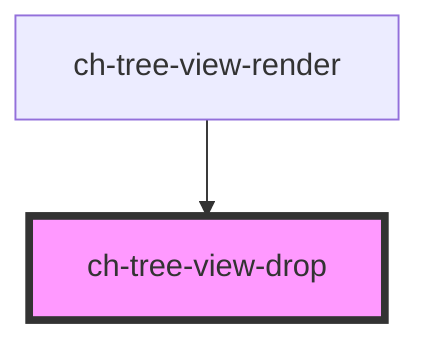

# ch-tree-view-drop

<!-- Auto Generated Below -->

## Properties

| Property     | Attribute      | Description                                                                          | Type                           | Default         |
| ------------ | -------------- | ------------------------------------------------------------------------------------ | ------------------------------ | --------------- |
| `dragState`  | `drag-state`   | This property lets you define the current state of the item when it's being dragged. | `"enter" \| "none" \| "start"` | `"none"`        |
| `level`      | `level`        | Level in the tree at which the item is placed.                                       | `number`                       | `INITIAL_LEVEL` |
| `treeItemId` | `tree-item-id` | Specifies the id of the tree item that this element controls.                        | `string`                       | `undefined`     |
| `type`       | `type`         | Specifies the type of drop that is performed over the control.                       | `"after" \| "before"`          | `"before"`      |

## Dependencies

### Used by

 - [ch-tree-view-render](../../renders/tree-view)

### Graph

----------------------------------------------

*Built with [StencilJS](https://stenciljs.com/)*
