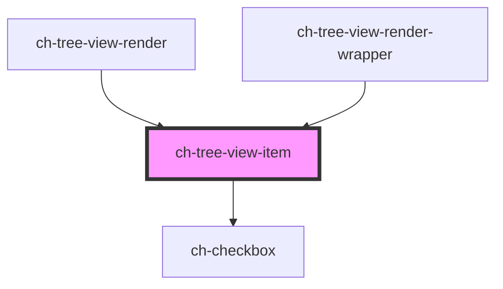

# ch-tree-x-list-item

<!-- Auto Generated Below -->

## Properties

| Property                 | Attribute                  | Description                                                                                                                                                                                                                                                                                | Type                               | Default         |
| ------------------------ | -------------------------- | ------------------------------------------------------------------------------------------------------------------------------------------------------------------------------------------------------------------------------------------------------------------------------------------ | ---------------------------------- | --------------- |
| `caption`                | `caption`                  | This attributes specifies the caption of the control                                                                                                                                                                                                                                       | `string`                           | `undefined`     |
| `checkbox`               | `checkbox`                 | Set this attribute if you want display a checkbox in the control.                                                                                                                                                                                                                          | `boolean`                          | `false`         |
| `checked`                | `checked`                  | Set this attribute if you want the checkbox to be checked by default. Only works if `checkbox = true`                                                                                                                                                                                      | `boolean`                          | `false`         |
| `customRender`           | `custom-render`            | Set this attribute if you want to set a custom render for the control, by passing a slot.                                                                                                                                                                                                  | `boolean`                          | `false`         |
| `disabled`               | `disabled`                 | This attribute lets you specify if the element is disabled. If disabled, it will not fire any user interaction related event (for example, click event).                                                                                                                                   | `boolean`                          | `false`         |
| `downloading`            | `downloading`              | This attribute lets you specify when items are being lazy loaded in the control.                                                                                                                                                                                                           | `boolean`                          | `false`         |
| `dragDisabled`           | `drag-disabled`            | This attribute lets you specify if the drag operation is disabled in the control. If `true`, the control can't be dragged.                                                                                                                                                                 | `boolean`                          | `false`         |
| `dragState`              | `drag-state`               | This property lets you define the current state of the item when it's being dragged.                                                                                                                                                                                                       | `"enter" \| "none" \| "start"`     | `"none"`        |
| `dropDisabled`           | `drop-disabled`            | This attribute lets you specify if the drop operation is disabled in the control. If `true`, the control won't accept any drops.                                                                                                                                                           | `boolean`                          | `false`         |
| `editable`               | `editable`                 | This attribute lets you specify if the edit operation is enabled in the control. If `true`, the control can edit its caption in place.                                                                                                                                                     | `boolean`                          | `undefined`     |
| `editing`                | `editing`                  | Set this attribute when the item is in edit mode                                                                                                                                                                                                                                           | `boolean`                          | `false`         |
| `expandOnClick`          | `expand-on-click`          | `true` to expand the control on click interaction. If `false`, with mouse interaction the control will only be expanded on double click.                                                                                                                                                   | `boolean`                          | `true`          |
| `expandableButton`       | `expandable-button`        | Specifies what kind of expandable button is displayed. Only works if `leaf === false`.  - `"expandableButton"`: Expandable button that allows to expand/collapse     the items of the control.  - `"decorative"`: Only a decorative icon is rendered to display the state     of the item. | `"action" \| "decorative" \| "no"` | `"decorative"`  |
| `expanded`               | `expanded`                 | If the item has a sub-tree, this attribute determines if the subtree is displayed.                                                                                                                                                                                                         | `boolean`                          | `false`         |
| `indeterminate`          | `indeterminate`            | `true` if the checkbox's value is indeterminate.                                                                                                                                                                                                                                           | `boolean`                          | `false`         |
| `lastItem`               | `last-item`                | This attribute specifies if the control is the last items in its subtree                                                                                                                                                                                                                   | `boolean`                          | `false`         |
| `lazyLoad`               | `lazy-load`                | Determine if the items are lazy loaded when opening the first time the control.                                                                                                                                                                                                            | `boolean`                          | `false`         |
| `leaf`                   | `leaf`                     | The presence of this attribute determine whether the item contains a subtree. `true` if the item does not have a subtree.                                                                                                                                                                  | `boolean`                          | `false`         |
| `leftImgSrc`             | `left-img-src`             | Set the left side icon from the available Gemini icon set : https://gx-gemini.netlify.app/?path=/story/icons-icons--controls                                                                                                                                                               | `string`                           | `undefined`     |
| `level`                  | `level`                    | Level in the tree at which the item is placed.                                                                                                                                                                                                                                             | `number`                           | `INITIAL_LEVEL` |
| `metadata`               | `metadata`                 | This attribute represents additional info for the control that is included when dragging the item.                                                                                                                                                                                         | `string`                           | `undefined`     |
| `rightImgSrc`            | `right-img-src`            | Set the right side icon from the available Gemini icon set : https://gx-gemini.netlify.app/?path=/story/icons-icons--controls                                                                                                                                                              | `string`                           | `undefined`     |
| `selected`               | `selected`                 | This attribute lets you specify if the item is selected                                                                                                                                                                                                                                    | `boolean`                          | `false`         |
| `showDownloadingSpinner` | `show-downloading-spinner` | `true` to show the downloading spinner when lazy loading the sub items of the control.                                                                                                                                                                                                     | `boolean`                          | `true`          |
| `showLines`              | `show-lines`               | `true` to display the relation between tree items and tree lists using lines.                                                                                                                                                                                                              | `"all" \| "last" \| "none"`        | `"none"`        |
| `toggleCheckboxes`       | `toggle-checkboxes`        | Set this attribute if you want all the children item's checkboxes to be checked when the parent item checkbox is checked, or to be unchecked when the parent item checkbox is unchecked.                                                                                                   | `boolean`                          | `false`         |

## Events

| Event                  | Description                                                                                                                     | Type                                                                                                                              |
| ---------------------- | ------------------------------------------------------------------------------------------------------------------------------- | --------------------------------------------------------------------------------------------------------------------------------- |
| `checkboxChange`       | Fired when the checkbox value of the control is changed.                                                                        | `CustomEvent<{ id: string; checked: boolean; indeterminate: boolean; }>`                                                          |
| `checkboxToggleChange` | Fired when the checkbox value of the control is changed. This event only applies when the control has `toggleCheckboxes = true` | `CustomEvent<{ id: string; checked: boolean; indeterminate: boolean; }>`                                                          |
| `itemDragEnd`          | Fired when the item is no longer being dragged.                                                                                 | `CustomEvent<any>`                                                                                                                |
| `itemDragStart`        | Fired when the item is being dragged.                                                                                           | `CustomEvent<{ elem: HTMLChTreeViewItemElement; dragEvent: DragEvent; }>`                                                         |
| `loadLazyContent`      | Fired when the lazy control is expanded an its content must be loaded.                                                          | `CustomEvent<string>`                                                                                                             |
| `modifyCaption`        | Fired when the item is asking to modify its caption.                                                                            | `CustomEvent<{ id: string; caption: string; }>`                                                                                   |
| `openReference`        | Fired when the user interacts with the control in a way that its reference must be opened.                                      | `CustomEvent<{ id: string; leaf: boolean; metadata: string; }>`                                                                   |
| `selectedItemChange`   | Fired when the selected state is updated by user interaction on the control.                                                    | `CustomEvent<{ ctrlKeyPressed: boolean; expanded: boolean; id: string; metadata: string; parentId: string; selected: boolean; }>` |

## Methods

### `focusLastItem(ctrlKeyPressed: boolean) => Promise<void>`

Focus the last item in its subtree. If the control is not expanded, it
focus the control.

#### Parameters

| Name             | Type      | Description |
| ---------------- | --------- | ----------- |
| `ctrlKeyPressed` | `boolean` |             |

#### Returns

Type: `Promise<void>`

### `focusNextItem(ctrlKeyPressed: boolean) => Promise<void>`

Focus the next item in the tree. If the control is expanded, it focuses
the first subitem in its tree.

#### Parameters

| Name             | Type      | Description |
| ---------------- | --------- | ----------- |
| `ctrlKeyPressed` | `boolean` |             |

#### Returns

Type: `Promise<void>`

### `focusNextSibling(ctrlKeyPressed: boolean) => Promise<void>`

Focus the next sibling item in the tree.

#### Parameters

| Name             | Type      | Description |
| ---------------- | --------- | ----------- |
| `ctrlKeyPressed` | `boolean` |             |

#### Returns

Type: `Promise<void>`

### `focusPreviousItem(ctrlKeyPressed: boolean) => Promise<void>`

Focus the previous item in the tree. If the previous item is expanded, it focuses
the last subitem in its tree.

#### Parameters

| Name             | Type      | Description |
| ---------------- | --------- | ----------- |
| `ctrlKeyPressed` | `boolean` |             |

#### Returns

Type: `Promise<void>`

### `setFocus(ctrlKeyPressed: boolean) => Promise<void>`

Set focus in the control.

#### Parameters

| Name             | Type      | Description |
| ---------------- | --------- | ----------- |
| `ctrlKeyPressed` | `boolean` |             |

#### Returns

Type: `Promise<void>`

### `updateChecked(newChecked: boolean, newIndeterminate: boolean) => Promise<void>`

Update `checked` and `indeterminate` properties.

#### Parameters

| Name               | Type      | Description |
| ------------------ | --------- | ----------- |
| `newChecked`       | `boolean` |             |
| `newIndeterminate` | `boolean` |             |

#### Returns

Type: `Promise<void>`

## Shadow Parts

| Part            | Description |
| --------------- | ----------- |
| `"downloading"` |             |
| `"edit-name"`   |             |

## Dependencies

### Used by

 - [ch-tree-view-render](../../renders/tree-view)
 - [ch-tree-view-render-wrapper](../../test/test-tree-view)

### Depends on

- [ch-checkbox](../../checkbox)

### Graph

----------------------------------------------

*Built with [StencilJS](https://stenciljs.com/)*
