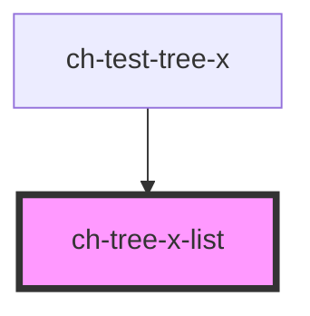

# ch-tree-x-list

<!-- Auto Generated Below -->

## Properties

| Property    | Attribute    | Description                                                                   | Type      | Default |
| ----------- | ------------ | ----------------------------------------------------------------------------- | --------- | ------- |
| `level`     | `level`      | Level in the tree at which the control is placed.                             | `number`  | `0`     |
| `showLines` | `show-lines` | `true` to display the relation between tree items and tree lists using lines. | `boolean` | `true`  |

## Dependencies

### Used by

 - [ch-test-tree-x](../test)

### Graph

----------------------------------------------

*Built with [StencilJS](https://stenciljs.com/)*
