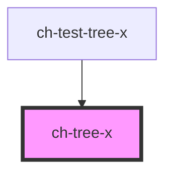

# ch-tree-x

<!-- Auto Generated Below -->

## Properties

| Property               | Attribute                 | Description                                                                                                        | Type      | Default |
| ---------------------- | ------------------------- | ------------------------------------------------------------------------------------------------------------------ | --------- | ------- |
| `multiSelection`       | `multi-selection`         | Set this attribute if you want to allow multi selection of the items.                                              | `boolean` | `false` |
| `openSubTreeCountdown` | `open-sub-tree-countdown` | This property lets you specify the time (in ms) that the mouse must be over in a subtree to open it when dragging. | `number`  | `750`   |
| `scrollToEdgeOnDrag`   | `scroll-to-edge-on-drag`  | `true` to scroll in the tree when dragging an item near the edges of the tree.                                     | `boolean` | `true`  |
| `waitDropProcessing`   | `wait-drop-processing`    | This property lets you specify if the tree is waiting to process the drop of items.                                | `boolean` | `false` |

## Events

| Event                 | Description                                                                                                                   | Type                                                                                                                                                 |
| --------------------- | ----------------------------------------------------------------------------------------------------------------------------- | ---------------------------------------------------------------------------------------------------------------------------------------------------- |
| `droppableZoneEnter`  | Fired when an element attempts to enter in a droppable zone where the tree has no information about the validity of the drop. | `CustomEvent<{ newContainer: GxDataTransferInfo; draggedItems: GxDataTransferInfo[]; }>`                                                             |
| `expandedItemChange`  | Fired when an item is expanded or collapsed.                                                                                  | `CustomEvent<{ id: string; expanded: boolean; }>`                                                                                                    |
| `itemsDropped`        | Fired when the dragged items are dropped in another item of the tree.                                                         | `CustomEvent<{ newContainer: GxDataTransferInfo; draggedItems: GxDataTransferInfo[]; draggingSelectedItems: boolean; dropInTheSameTree: boolean; }>` |
| `selectedItemsChange` | Fired when the selected items change.                                                                                         | `CustomEvent<Map<string, TreeXListItemSelectedInfo>>`                                                                                                |

## Methods

### `clearSelectedItemsInfo() => Promise<void>`

Clear all information about the selected items. This method is intended to
be used when selected items are reordered and the selected references will
no longer be useful.

#### Returns

Type: `Promise<void>`

### `scrollIntoVisible(treeItemId: string) => Promise<void>`

Given an item id, it displays and scrolls into the item view.

#### Returns

Type: `Promise<void>`

### `updateValidDropZone(requestTimestamp: number, newContainerId: string, draggedItems: GxDataTransferInfo[], validDrop: boolean) => Promise<void>`

Update the information about the valid droppable zones.

#### Returns

Type: `Promise<void>`

## Dependencies

### Used by

 - [ch-test-tree-x](../test)

### Graph

----------------------------------------------

*Built with [StencilJS](https://stenciljs.com/)*
