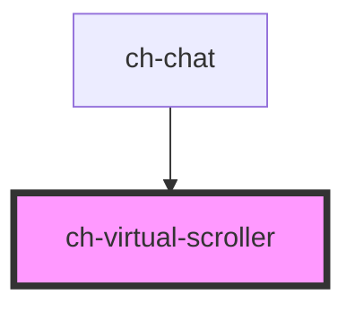

# ch-smart-grid-virtual-scroller

<!-- Auto Generated Below -->


## Overview

The `ch-virtual-scroller` component provides efficient virtual scrolling for large lists of items within a `ch-smart-grid`, keeping only visible items plus a configurable buffer in the DOM.

## Features
 - `"virtual-scroll"` mode: removes items outside the viewport from the DOM, using virtual spacers to maintain scroll height. Lowest memory footprint.
 - `"lazy-render"` mode: lazily renders items as they scroll into view, but keeps them in the DOM once rendered. Avoids re-rendering costs.
 - Configurable buffer amount for items rendered above and below the viewport.
 - Inverse loading support (newest items at bottom, scroll starts at end) for chat-style interfaces.
 - Automatic re-rendering on scroll and resize events.

## Use when
 - Rendering hundreds or thousands of items inside a `ch-smart-grid`.
 - Building chat interfaces that need efficient inverse-loaded virtual scrolling.
 - Rendering lists of hundreds or thousands of items efficiently within `ch-smart-grid`.

## Do not use when
 - The list is small enough to render all items at once without performance concerns.
 - The list has fewer than ~100 items — the overhead of virtual scrolling is not justified.
 - Used outside of `ch-smart-grid` — this component is designed to work in tandem with `ch-smart-grid`.

```
  <ch-smart-grid>
    #shadow-root (open)
    |  <slot name="grid-content"></slot>
    <ch-virtual-scroller slot="grid-content">
      <ch-smart-grid-cell>...</ch-smart-grid-cell>
      <ch-smart-grid-cell>...</ch-smart-grid-cell>
      ...
    </ch-virtual-scroller>
  </ch-smart-grid>
```

## Properties

| Property                     | Attribute                       | Description                                                                                                                                                                                                                                                                                                                                                                                                                                                                                          | Type                                | Default            |
| ---------------------------- | ------------------------------- | ---------------------------------------------------------------------------------------------------------------------------------------------------------------------------------------------------------------------------------------------------------------------------------------------------------------------------------------------------------------------------------------------------------------------------------------------------------------------------------------------------- | ----------------------------------- | ------------------ |
| `bufferAmount`               | `buffer-amount`                 | The number of elements to be rendered above and below the current container's viewport.                                                                                                                                                                                                                                                                                                                                                                                                              | `number`                            | `5`                |
| `initialRenderViewportItems` | `initial-render-viewport-items` | Specifies an estimation for the items that will enter in the viewport of the initial render.                                                                                                                                                                                                                                                                                                                                                                                                         | `number`                            | `10`               |
| `inverseLoading`             | `inverse-loading`               | When set to `true`, the grid items will be loaded in inverse order, with the scroll positioned at the bottom on the initial load.  If `mode="virtual-scroll"`, only the items at the start of the viewport that are not visible will be removed from the DOM. The items at the end of the viewport that are not visible will remain rendered to avoid flickering issues.                                                                                                                             | `boolean`                           | `false`            |
| `items` _(required)_         | --                              | The array of items to be rendered in the ch-smart-grid.                                                                                                                                                                                                                                                                                                                                                                                                                                              | `SmartGridItem[]`                   | `undefined`        |
| `itemsCount`                 | `items-count`                   | The number of elements in the items array. Use if the array changes, without recreating the array.                                                                                                                                                                                                                                                                                                                                                                                                   | `number`                            | `undefined`        |
| `mode`                       | `mode`                          | Specifies how the control will behave.   - "virtual-scroll": Only the items at the start of the viewport that are   not visible will be removed from the DOM. The items at the end of the   viewport that are not visible will remain rendered to avoid flickering   issues.    - "lazy-render": It behaves similarly to "virtual-scroll" on the initial   load, but when the user scrolls and new items are rendered, those items   that are outside of the viewport won't be removed from the DOM. | `"lazy-render" \| "virtual-scroll"` | `"virtual-scroll"` |


## Events

| Event                    | Description                                                                           | Type                                                                                                       |
| ------------------------ | ------------------------------------------------------------------------------------- | ---------------------------------------------------------------------------------------------------------- |
| `virtualItemsChanged`    | Emitted when the array of visible items in the ch-smart-grid changes.                 | `CustomEvent<{ virtualItems: SmartGridModel; startIndex: number; endIndex: number; totalItems: number; }>` |
| `virtualScrollerDidLoad` | Fired when the visible content of the virtual scroller did render for the first time. | `CustomEvent<any>`                                                                                         |


## Methods

### `addItems(position: "start" | "end", ...items: SmartGridModel) => Promise<void>`

Add items to the beginning or end of the items property. This method is
useful for adding new items to the collection, without impacting in the
internal indexes used to display the virtual items. Without this method,
the virtual scroll would behave unexpectedly when new items are added.

#### Parameters

| Name       | Type               | Description |
| ---------- | ------------------ | ----------- |
| `position` | `"start" \| "end"` |             |
| `items`    | `SmartGridItem[]`  |             |

#### Returns

Type: `Promise<void>`

## Slots

| Slot        | Description                                                                                 |
| ----------- | ------------------------------------------------------------------------------------------- |
| `"default"` | The slot for `ch-smart-grid-cell` elements representing the items to be virtually scrolled. |


## Dependencies

### Used by

 - [ch-chat](../chat)

### Graph


----------------------------------------------

*Built with [StencilJS](https://stenciljs.com/)*
