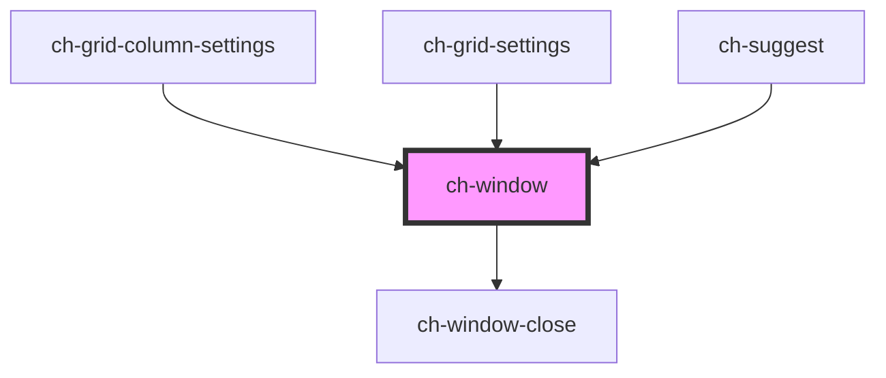

# ch-modal

<!-- Auto Generated Below -->

## Properties

| Property              | Attribute                | Description                                                                          | Type                                                                             | Default     |
| --------------------- | ------------------------ | ------------------------------------------------------------------------------------ | -------------------------------------------------------------------------------- | ----------- |
| `allowDrag`           | `allow-drag`             | Specifies the drag behavior of the window.                                           | `"box" \| "header" \| "no"`                                                      | `"no"`      |
| `caption`             | `caption`                | The caption or title of the window.                                                  | `string`                                                                         | `""`        |
| `closeOnEscape`       | `close-on-escape`        | Determines whether the window should close when the Escape key is pressed.           | `boolean`                                                                        | `undefined` |
| `closeOnOutsideClick` | `close-on-outside-click` | Determines whether the window should close when clicked outside.                     | `boolean`                                                                        | `undefined` |
| `closeText`           | `close-text`             | The text for the close button.                                                       | `string`                                                                         | `undefined` |
| `closeTooltip`        | `close-tooltip`          | The tooltip text for the close button.                                               | `string`                                                                         | `undefined` |
| `container`           | --                       | The container element for the window.                                                | `HTMLElement`                                                                    | `undefined` |
| `hidden`              | `hidden`                 | Determines if the window is hidden or visible.                                       | `boolean`                                                                        | `true`      |
| `modal`               | `modal`                  | Specifies whether the window should be displayed as a modal.                         | `boolean`                                                                        | `true`      |
| `showFooter`          | `show-footer`            | This attribute lets you specify if a footer is rendered at the bottom of the window. | `boolean`                                                                        | `true`      |
| `showHeader`          | `show-header`            | This attribute lets you specify if a header is rendered on top of the window.        | `boolean`                                                                        | `true`      |
| `xAlign`              | `x-align`                | The horizontal alignment of the window.                                              | `"center" \| "inside-end" \| "inside-start" \| "outside-end" \| "outside-start"` | `"center"`  |
| `yAlign`              | `y-align`                | The vertical alignment of the window.                                                | `"center" \| "inside-end" \| "inside-start" \| "outside-end" \| "outside-start"` | `"center"`  |

## Events

| Event          | Description                        | Type               |
| -------------- | ---------------------------------- | ------------------ |
| `windowClosed` | Emitted when the window is closed. | `CustomEvent<any>` |
| `windowOpened` | Emitted when the window is opened. | `CustomEvent<any>` |

## Shadow Parts

| Part        | Description |
| ----------- | ----------- |
| `"caption"` |             |
| `"close"`   |             |
| `"footer"`  |             |
| `"header"`  |             |
| `"main"`    |             |
| `"mask"`    |             |
| `"window"`  |             |

## Dependencies

### Used by

 - [ch-grid-column-settings](../grid/grid-column/grid-column-settings)
 - [ch-grid-settings](../grid/grid-settings)
 - [ch-suggest](../suggest)

### Depends on

- [ch-window-close](window-close)

### Graph

----------------------------------------------

*Built with [StencilJS](https://stenciljs.com/)*
