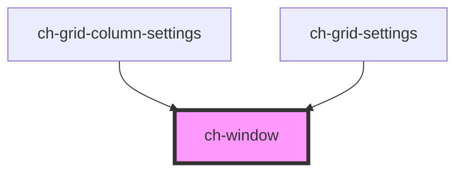

# ch-modal

<!-- Auto Generated Below -->

## Properties

| Property       | Attribute       | Description | Type      | Default     |
| -------------- | --------------- | ----------- | --------- | ----------- |
| `caption`      | `caption`       |             | `string`  | `""`        |
| `closeAuto`    | `close-auto`    |             | `boolean` | `undefined` |
| `closeText`    | `close-text`    |             | `string`  | `undefined` |
| `closeTooltip` | `close-tooltip` |             | `string`  | `undefined` |
| `hidden`       | `hidden`        |             | `boolean` | `true`      |
| `modal`        | `modal`         |             | `boolean` | `true`      |

## Events

| Event          | Description | Type               |
| -------------- | ----------- | ------------------ |
| `windowClosed` |             | `CustomEvent<any>` |

## Shadow Parts

| Part        | Description |
| ----------- | ----------- |
| `"caption"` |             |
| `"close"`   |             |
| `"footer"`  |             |
| `"header"`  |             |
| `"main"`    |             |
| `"mask"`    |             |
| `"window"`  |             |

## Dependencies

### Used by

 - [ch-grid-column-settings](../grid/grid-column/grid-column-settings)
 - [ch-grid-settings](../grid/grid-settings)

### Graph

----------------------------------------------

*Built with [StencilJS](https://stenciljs.com/)*
