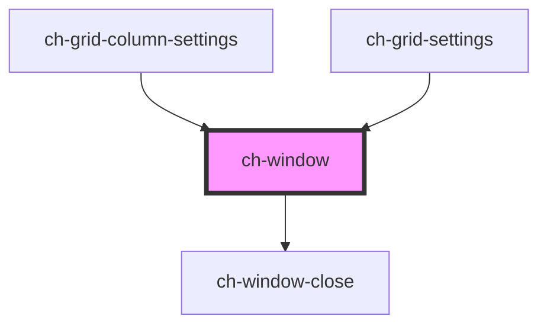

# ch-modal

<!-- Auto Generated Below -->

## Properties

| Property              | Attribute                | Description | Type                                                                             | Default     |
| --------------------- | ------------------------ | ----------- | -------------------------------------------------------------------------------- | ----------- |
| `allowDrag`           | `allow-drag`             |             | `"box" \| "header" \| "no"`                                                      | `"no"`      |
| `caption`             | `caption`                |             | `string`                                                                         | `""`        |
| `closeOnEscape`       | `close-on-escape`        |             | `boolean`                                                                        | `undefined` |
| `closeOnOutsideClick` | `close-on-outside-click` |             | `boolean`                                                                        | `undefined` |
| `closeText`           | `close-text`             |             | `string`                                                                         | `undefined` |
| `closeTooltip`        | `close-tooltip`          |             | `string`                                                                         | `undefined` |
| `container`           | --                       |             | `HTMLElement`                                                                    | `undefined` |
| `hidden`              | `hidden`                 |             | `boolean`                                                                        | `true`      |
| `modal`               | `modal`                  |             | `boolean`                                                                        | `true`      |
| `xAlign`              | `x-align`                |             | `"center" \| "inside-end" \| "inside-start" \| "outside-end" \| "outside-start"` | `"center"`  |
| `yAlign`              | `y-align`                |             | `"center" \| "inside-end" \| "inside-start" \| "outside-end" \| "outside-start"` | `"center"`  |

## Events

| Event          | Description | Type               |
| -------------- | ----------- | ------------------ |
| `windowClosed` |             | `CustomEvent<any>` |
| `windowOpened` |             | `CustomEvent<any>` |

## Shadow Parts

| Part        | Description |
| ----------- | ----------- |
| `"caption"` |             |
| `"close"`   |             |
| `"footer"`  |             |
| `"header"`  |             |
| `"main"`    |             |
| `"mask"`    |             |
| `"window"`  |             |

## Dependencies

### Used by

 - [ch-grid-column-settings](../grid/grid-column/grid-column-settings)
 - [ch-grid-settings](../grid/grid-settings)

### Depends on

- [ch-window-close](window-close)

### Graph

----------------------------------------------

*Built with [StencilJS](https://stenciljs.com/)*
