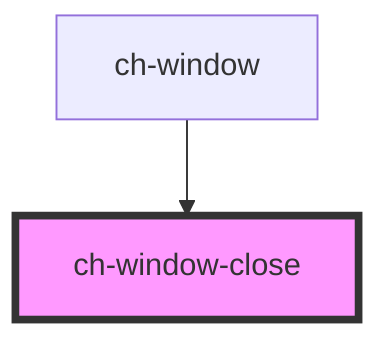

# ch-window-close

<!-- Auto Generated Below -->

## Overview

The 'ch-window-close' component represents the close button for the 'ch-window' component.

## Properties

| Property   | Attribute  | Description                                     | Type      | Default     |
| ---------- | ---------- | ----------------------------------------------- | --------- | ----------- |
| `disabled` | `disabled` | Specifies whether the close button is disabled. | `boolean` | `undefined` |

## Events

| Event                | Description                               | Type               |
| -------------------- | ----------------------------------------- | ------------------ |
| `windowCloseClicked` | Emitted when the close button is clicked. | `CustomEvent<any>` |

## Dependencies

### Used by

 - [ch-window](..)

### Graph

----------------------------------------------

*Built with [StencilJS](https://stenciljs.com/)*
