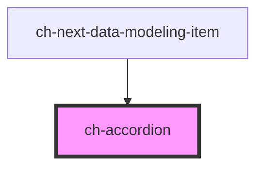

# ch-accordion

This control implements a simple accordion with a header and a collapsible/expandable content. The content can be expanded/collapsed by clicking on the header of the control.

<!-- Auto Generated Below -->

> **[DEPRECATED]** Use the `ch-accordion-render` instead

## Properties

| Property                | Attribute                | Description                          | Type      | Default |
| ----------------------- | ------------------------ | ------------------------------------ | --------- | ------- |
| `accessibleDescription` | `accessible-description` | The description of the entity.       | `string`  | `""`    |
| `accessibleName`        | `accessible-name`        | The name of the entity.              | `string`  | `""`    |
| `expanded`              | `expanded`               | `true` if the accordion is expanded. | `boolean` | `false` |

## Events

| Event            | Description                                     | Type                   |
| ---------------- | ----------------------------------------------- | ---------------------- |
| `expandedChange` | Fired when the content is expanded or collapsed | `CustomEvent<boolean>` |

## Slots

| Slot        | Description                                                                      |
| ----------- | -------------------------------------------------------------------------------- |
| `"content"` | The component to be displayed as the content of the accordion (below the header) |
| `"header"`  | The component to be displayed in the header of the control                       |

## Shadow Parts

| Part                      | Description                            |
| ------------------------- | -------------------------------------- |
| `"accordion__chevron"`    |                                        |
| `"accordion__expandable"` | The container of the accordion content |
| `"accordion__header"`     |                                        |

## Dependencies

### Used by

 - [ch-next-data-modeling-item](../../components/next/data-modeling-item)

### Graph

----------------------------------------------

*Built with [StencilJS](https://stenciljs.com/)*
