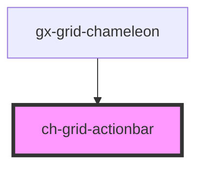

# ch-grid-toolbar

<!-- Auto Generated Below -->

> **[DEPRECATED]** Use `ch-tabular-grid` component instead. Use `ch-tabular-grid-actionbar` instead.

## Overview

The `ch-grid-actionbar` component represents a container for a grid actions.

## Dependencies

### Used by

 - [gx-grid-chameleon](../../../components/gx-grid)

### Graph

----------------------------------------------

*Built with [StencilJS](https://stenciljs.com/)*
