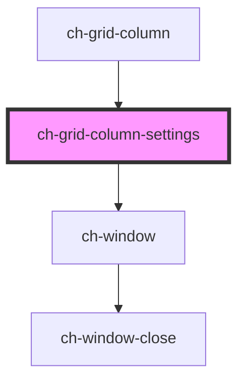

# ch-grid-menu-columns

<!-- Auto Generated Below -->

> **[DEPRECATED]** Use `ch-tabular-grid` component instead. Use `ch-tabular-grid-column-settings` instead.

## Overview

The `ch-grid-column-settings` component represents a settings window for a column.

## Properties

| Property              | Attribute | Description                                                                | Type                      | Default     |
| --------------------- | --------- | -------------------------------------------------------------------------- | ------------------------- | ----------- |
| `column` _(required)_ | --        | The `HTMLChGridColumnElement` that the settings window is associated with. | `HTMLChGridColumnElement` | `undefined` |
| `show`                | `show`    | Indicates whether the settings window is currently shown or not.           | `boolean`                 | `false`     |

## Dependencies

### Used by

 - [ch-grid-column](..)

### Depends on

- [ch-window](../../../window)

### Graph

----------------------------------------------

*Built with [StencilJS](https://stenciljs.com/)*
