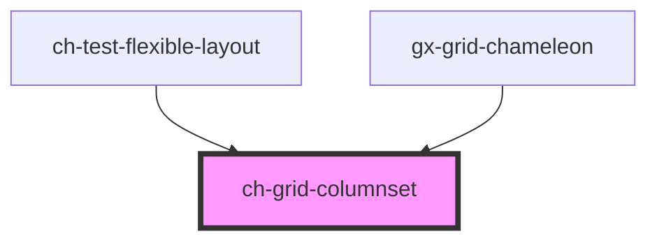

# ch-grid-columnset

<!-- Auto Generated Below -->

> **[DEPRECATED]** Use `ch-tabular-grid` component instead. Use `ch-tabular-grid-columnset` instead.

## Overview

The `ch-grid-columnset` component represents a group of columns.

## Dependencies

### Used by

 - [ch-test-flexible-layout](../../../components/test/test-flexible-layout)
 - [gx-grid-chameleon](../../../components/gx-grid)

### Graph

----------------------------------------------

*Built with [StencilJS](https://stenciljs.com/)*
