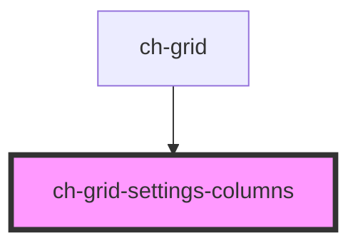

# ch-grid-settings-columns

<!-- Auto Generated Below -->

> **[DEPRECATED]** Use `ch-tabular-grid` component instead. Use `ch-tabular-grid-settings-columns` instead.

## Overview

The `ch-grid-settings-columns` component represents the settings for a grid's columns.

## Properties

| Property               | Attribute | Description                            | Type                        | Default     |
| ---------------------- | --------- | -------------------------------------- | --------------------------- | ----------- |
| `columns` _(required)_ | --        | An array of column elements to render. | `HTMLChGridColumnElement[]` | `undefined` |

## Shadow Parts

| Part             | Description |
| ---------------- | ----------- |
| `"column"`       |             |
| `"column-label"` |             |

## Dependencies

### Used by

 - [ch-grid](../..)

### Graph

----------------------------------------------

*Built with [StencilJS](https://stenciljs.com/)*
