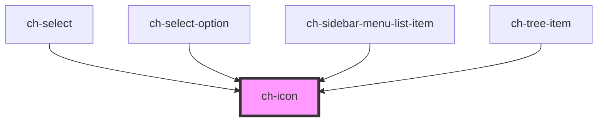

# ch-icon

A component for displaying SVG icons that allows overriding the `fill` property by setting the `--icon-color` property.

<!-- Auto Generated Below -->

## Properties

| Property    | Attribute    | Description                                                                   | Type                                                                                                                                                                                     | Default     |
| ----------- | ------------ | ----------------------------------------------------------------------------- | ---------------------------------------------------------------------------------------------------------------------------------------------------------------------------------------- | ----------- |
| `autoColor` | `auto-color` | If enabled, the icon will display its inherent/natural color                  | `boolean`                                                                                                                                                                                | `false`     |
| `color`     | `color`      | The color of the icon.                                                        | `"alwaysblack" \| "auto" \| "disabled" \| "error" \| "negative" \| "onbackground" \| "ondisabled" \| "primary-active" \| "primary-enabled" \| "primary-hover" \| "success" \| "warning"` | `undefined` |
| `lazy`      | `lazy`       | If enabled, the icon will be loaded lazily when it's visible in the viewport. | `boolean`                                                                                                                                                                                | `false`     |
| `size`      | `size`       | The size of the icon. Possible values: regular, small.                        | `"regular" \| "small"`                                                                                                                                                                   | `"regular"` |
| `src`       | `src`        | The URL of the icon.                                                          | `string`                                                                                                                                                                                 | `""`        |

## CSS Custom Properties

| Name           | Description                                        |
| -------------- | -------------------------------------------------- |
| `--icon-color` | Color of the icon (sets the SVG's `fill` property) |
| `--icon-size`  | Size of the icon (sets both width and height)      |

## Dependencies

### Used by

 - [ch-select](../select)
 - [ch-select-option](../select-item)
 - [ch-sidebar-menu-list-item](../sidebar-menu-list-item)
 - [ch-tree-item](../tree-item)

### Graph

----------------------------------------------

*Built with [StencilJS](https://stenciljs.com/)*
