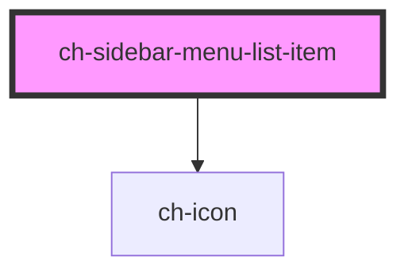

# ch-sidebar-menu-list-item

<!-- Auto Generated Below -->

## Properties

| Property      | Attribute       | Description                                                         | Type      | Default     |
| ------------- | --------------- | ------------------------------------------------------------------- | --------- | ----------- |
| `autoColor`   | `auto-color`    | If enabled, the icon will display its inherent/natural color        | `boolean` | `false`     |
| `itemIconSrc` | `item-icon-src` | The first list item icon (optional)                                 | `string`  | `undefined` |
| `uncollapsed` | `uncollapsed`   | If this attribute is present the item will be initially uncollapsed | `boolean` | `false`     |

## Events

| Event              | Description        | Type               |
| ------------------ | ------------------ | ------------------ |
| `itemClickedEvent` | Emmits the item id | `CustomEvent<any>` |

## Shadow Parts

| Part                    | Description |
| ----------------------- | ----------- |
| `"collapse-item-icon"`  |             |
| `"collapse-item2-icon"` |             |

## Dependencies

### Depends on

- [ch-icon](../icon)

### Graph

----------------------------------------------

*Built with [StencilJS](https://stenciljs.com/)*
