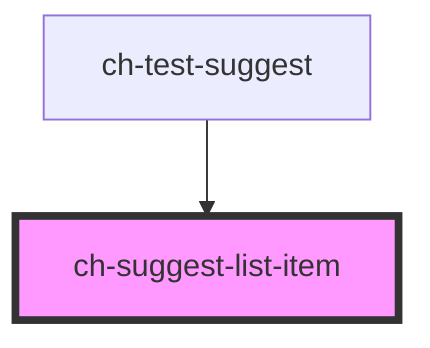

# ch-suggest-list-item

<!-- Auto Generated Below -->

## Properties

| Property  | Attribute  | Description    | Type     | Default     |
| --------- | ---------- | -------------- | -------- | ----------- |
| `iconSrc` | `icon-src` | The icon url   | `string` | `undefined` |
| `value`   | `value`    | The item value | `any`    | `undefined` |

## Events

| Event                | Description                                                                                                               | Type                                                                                             |
| -------------------- | ------------------------------------------------------------------------------------------------------------------------- | ------------------------------------------------------------------------------------------------ |
| `focusChangeAttempt` | This event is emitted every time the item is about to lose focus, by pressing the "ArrowUp" or "ArrowDown" keyboard keys. | `CustomEvent<{ el: HTMLChSuggestListItemElement; code: ChSuggestKeyDownEvents; }>`               |
| `itemSelected`       | This event is emitted every time the item is selected, either by clicking on it, or by pressing Enter.                    | `CustomEvent<{ value: any; indexes: SuggestItemIndexes; description?: string; icon?: string; }>` |

## Shadow Parts

| Part                | Description |
| ------------------- | ----------- |
| `"button"`          |             |
| `"content-wrapper"` |             |

## Dependencies

### Used by

 - [ch-test-suggest](../../test/test-suggest)

### Graph

----------------------------------------------

*Built with [StencilJS](https://stenciljs.com/)*
