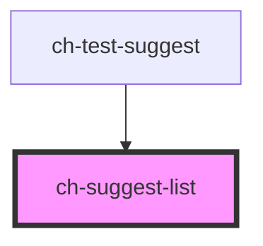

# ch-suggest-list

<!-- Auto Generated Below -->

> **[DEPRECATED]** Use the `ch-combo-box-render` with `suggest = true`

## Properties

| Property | Attribute | Description | Type     | Default     |
| -------- | --------- | ----------- | -------- | ----------- |
| `label`  | `label`   | The label   | `string` | `undefined` |

## Shadow Parts

| Part      | Description |
| --------- | ----------- |
| `"list"`  |             |
| `"title"` |             |

## Dependencies

### Used by

 - [ch-test-suggest](../../test/test-suggest)

### Graph

----------------------------------------------

*Built with [StencilJS](https://stenciljs.com/)*
