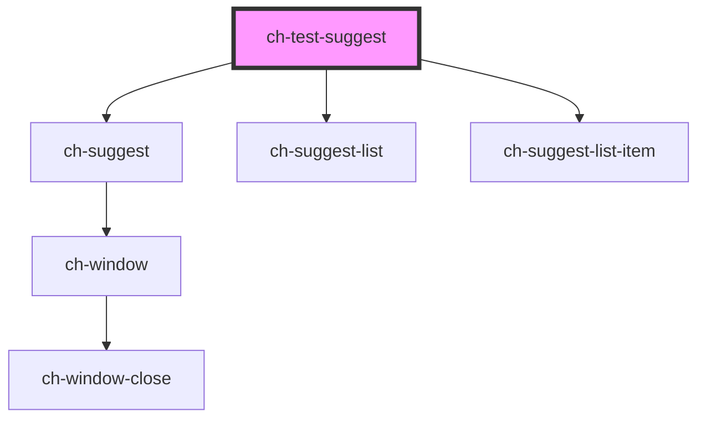

# ch-test-suggest

<!-- Auto Generated Below -->

## Properties

| Property                 | Attribute | Description                                                                                                      | Type                                                  | Default     |
| ------------------------ | --------- | ---------------------------------------------------------------------------------------------------------------- | ----------------------------------------------------- | ----------- |
| `selectorSourceCallback` | --        | Callback invoked when user writes on object selector input, return possible options to show in autocomplete list | `(prefix: string) => Promise<SelectorCategoryData[]>` | `undefined` |

## Shadow Parts

| Part                        | Description |
| --------------------------- | ----------- |
| `"object-selector-suggest"` |             |

## Dependencies

### Depends on

- [ch-suggest](../../../deprecated-components/suggest)
- [ch-suggest-list](../../../deprecated-components/suggest/suggest-list)
- [ch-suggest-list-item](../../../deprecated-components/suggest/suggest-list-item)

### Graph

----------------------------------------------

*Built with [StencilJS](https://stenciljs.com/)*
