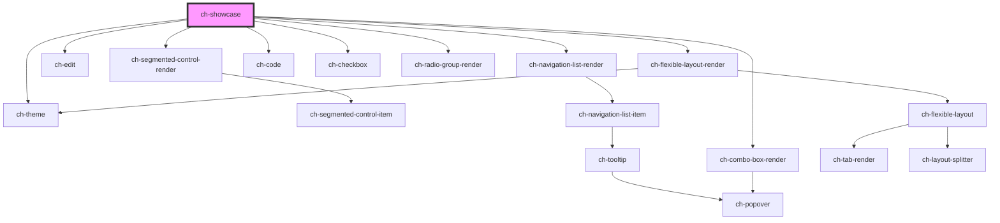

# ch-showcase

<!-- Auto Generated Below -->

## Properties

| Property               | Attribute            | Description                                                                                                                                                                                                                                                                                                                                                                                                                                                                                                                                                                                                                                                                                                                                                                                                                                                                                                                                                | Type                                                                                                              | Default     |
| ---------------------- | -------------------- | ---------------------------------------------------------------------------------------------------------------------------------------------------------------------------------------------------------------------------------------------------------------------------------------------------------------------------------------------------------------------------------------------------------------------------------------------------------------------------------------------------------------------------------------------------------------------------------------------------------------------------------------------------------------------------------------------------------------------------------------------------------------------------------------------------------------------------------------------------------------------------------------------------------------------------------------------------------- | ----------------------------------------------------------------------------------------------------------------- | ----------- |
| `colorScheme`          | `color-scheme`       | Specifies the theme used in the iframe of the control                                                                                                                                                                                                                                                                                                                                                                                                                                                                                                                                                                                                                                                                                                                                                                                                                                                                                                      | `"dark" \| "light"`                                                                                               | `undefined` |
| `designSystem`         | `design-system`      | Specifies the design system used in the iframe of the control                                                                                                                                                                                                                                                                                                                                                                                                                                                                                                                                                                                                                                                                                                                                                                                                                                                                                              | `"mercury" \| "unanimo"`                                                                                          | `undefined` |
| `languageDirection`    | `language-direction` | Specifies the language direction of the document                                                                                                                                                                                                                                                                                                                                                                                                                                                                                                                                                                                                                                                                                                                                                                                                                                                                                                           | `"ltr" \| "rtl"`                                                                                                  | `undefined` |
| `packageVersion`       | `package-version`    | Specifies the version of the showcase displayed in the header                                                                                                                                                                                                                                                                                                                                                                                                                                                                                                                                                                                                                                                                                                                                                                                                                                                                                              | `string`                                                                                                          | `undefined` |
| `pages`                | --                   | Specifies the pages that will be displayed in the sidebar                                                                                                                                                                                                                                                                                                                                                                                                                                                                                                                                                                                                                                                                                                                                                                                                                                                                                                  | `NavigationListItemModel[]`                                                                                       | `undefined` |
| `status`               | `status`             | Specifies the development status of the control.   - "experimental": The control is in its early stages of the development.     This phase is often useful for testing the control early, but it is     very likely that the interface will change from the final version.      Breaking changes for the control can be applied in "patch" tags.    - "developer-preview": The control is in its final stages of the     development. The interface and behaviors to implement the control are     almost complete. The interface of the control should not change so much     from the final version.      Breaking changes for the control can be applied in "major" tags.    - "stable": The control's development is stable and can be safety used     in production environments.      Breaking changes for the control can be applied in "major" tags. In     some cases, two "major" tags would be used to deprecate a behavior in     the control. | `"developer-preview" \| "experimental" \| "stable"`                                                               | `undefined` |
| `stories` _(required)_ | --                   | Specifies the stories for the showcase.                                                                                                                                                                                                                                                                                                                                                                                                                                                                                                                                                                                                                                                                                                                                                                                                                                                                                                                    | `{ custom: { [key: string]: ShowcaseCustomStory; }; landing: ShowcaseCustomStory; playground: ShowcaseStories; }` | `undefined` |

## Dependencies

### Depends on

- [ch-theme](../../../components/theme)
- [ch-segmented-control-render](../../../components/segmented-control)
- [ch-edit](../../../components/edit)
- [ch-navigation-list-render](../../../components/navigation-list)
- [ch-code](../../../components/code)
- [ch-checkbox](../../../components/checkbox)
- [ch-combo-box-render](../../../components/combo-box)
- [ch-radio-group-render](../../../components/radio-group)
- [ch-flexible-layout-render](../../../components/flexible-layout)

### Graph

----------------------------------------------

*Built with [StencilJS](https://stenciljs.com/)*
