# ch-showcase

<!-- Auto Generated Below -->

## Properties

| Property        | Attribute        | Description                                                                                                                                                                                                                                                                                                                                                                                                                                                                                                                                                                                                                                                                                                                                                                                                                                                                                                                                                | Type                                                | Default     |
| --------------- | ---------------- | ---------------------------------------------------------------------------------------------------------------------------------------------------------------------------------------------------------------------------------------------------------------------------------------------------------------------------------------------------------------------------------------------------------------------------------------------------------------------------------------------------------------------------------------------------------------------------------------------------------------------------------------------------------------------------------------------------------------------------------------------------------------------------------------------------------------------------------------------------------------------------------------------------------------------------------------------------------- | --------------------------------------------------- | ----------- |
| `colorScheme`   | `color-scheme`   | Specifies the theme used in the iframe of the control                                                                                                                                                                                                                                                                                                                                                                                                                                                                                                                                                                                                                                                                                                                                                                                                                                                                                                      | `"dark" \| "light"`                                 | `undefined` |
| `componentName` | `component-name` | Specifies the name of the control.                                                                                                                                                                                                                                                                                                                                                                                                                                                                                                                                                                                                                                                                                                                                                                                                                                                                                                                         | `string`                                            | `undefined` |
| `designSystem`  | `design-system`  | Specifies the design system used in the iframe of the control                                                                                                                                                                                                                                                                                                                                                                                                                                                                                                                                                                                                                                                                                                                                                                                                                                                                                              | `"mercury" \| "unanimo"`                            | `undefined` |
| `pageName`      | `page-name`      | Specifies the title for the current showcase.                                                                                                                                                                                                                                                                                                                                                                                                                                                                                                                                                                                                                                                                                                                                                                                                                                                                                                              | `string`                                            | `undefined` |
| `pageSrc`       | `page-src`       | Specifies the HTML directory where the showcase for the control is placed.                                                                                                                                                                                                                                                                                                                                                                                                                                                                                                                                                                                                                                                                                                                                                                                                                                                                                 | `string`                                            | `undefined` |
| `status`        | `status`         | Specifies the development status of the control.   - "experimental": The control is in its early stages of the development.     This phase is often useful for testing the control early, but it is     very likely that the interface will change from the final version.      Breaking changes for the control can be applied in "patch" tags.    - "developer-preview": The control is in its final stages of the     development. The interface and behaviors to implement the control are     almost complete. The interface of the control should not change so much     from the final version.      Breaking changes for the control can be applied in "major" tags.    - "stable": The control's development is stable and can be safety used     in production environments.      Breaking changes for the control can be applied in "major" tags. In     some cases, two "major" tags would be used to deprecate a behavior in     the control. | `"developer-preview" \| "experimental" \| "stable"` | `undefined` |

## Dependencies

### Depends on

- [ch-code](../../../components/code)
- [ch-flexible-layout-render](../../../components/flexible-layout)
- [ch-checkbox](../../../components/checkbox)
- [ch-combo-box-render](../../../components/combobox)
- [ch-radio-group-render](../../../components/radio-group)
- [ch-action-group-render](../../../components/action-group)
- [ch-action-list-render](../../../components/action-list)
- [ch-barcode-scanner](../../../components/barcode-scanner)
- [ch-chat](../../../components/chat)
- [ch-dialog](../../../components/dialog)
- [ch-dropdown-render](../../../components/dropdown)
- [ch-edit](../../../components/edit)
- [ch-test-flexible-layout](../../../components/test/test-flexible-layout)
- [ch-image](../../../components/image)
- [ch-layout-splitter](../../../components/layout-splitter)
- [ch-markdown-viewer](../../../components/markdown-viewer)
- [ch-popover](../../../components/popover)
- [ch-qr](../../../components/qr)
- [ch-segmented-control-render](../../../components/segmented-control)
- [ch-slider](../../../components/slider)
- [ch-switch](../../../components/switch)
- [ch-tab-render](../../../components/tab)
- [ch-tree-view-render](../../../components/tree-view)
- [ch-textblock](../../../components/textblock)

### Graph

```mermaid
graph TD;
  ch-showcase --> ch-code
  ch-showcase --> ch-flexible-layout-render
  ch-showcase --> ch-checkbox
  ch-showcase --> ch-combo-box-render
  ch-showcase --> ch-radio-group-render
  ch-showcase --> ch-action-group-render
  ch-showcase --> ch-action-list-render
  ch-showcase --> ch-barcode-scanner
  ch-showcase --> ch-chat
  ch-showcase --> ch-dialog
  ch-showcase --> ch-dropdown-render
  ch-showcase --> ch-edit
  ch-showcase --> ch-test-flexible-layout
  ch-showcase --> ch-image
  ch-showcase --> ch-layout-splitter
  ch-showcase --> ch-markdown-viewer
  ch-showcase --> ch-popover
  ch-showcase --> ch-qr
  ch-showcase --> ch-segmented-control-render
  ch-showcase --> ch-slider
  ch-showcase --> ch-switch
  ch-showcase --> ch-tab-render
  ch-showcase --> ch-tree-view-render
  ch-showcase --> ch-textblock
  ch-flexible-layout-render --> ch-flexible-layout
  ch-flexible-layout --> ch-tab-render
  ch-flexible-layout --> ch-layout-splitter
  ch-combo-box-render --> ch-popover
  ch-action-group-render --> ch-dropdown
  ch-action-group-render --> ch-action-group
  ch-action-group-render --> ch-action-group-item
  ch-dropdown --> ch-popover
  ch-action-group --> ch-dropdown
  ch-action-list-render --> ch-action-list-item
  ch-action-list-render --> ch-action-list-group
  ch-chat --> ch-smart-grid
  ch-chat --> ch-smart-grid-virtual-scroller
  ch-chat --> ch-edit
  ch-chat --> ch-code
  ch-chat --> ch-markdown-viewer
  ch-chat --> ch-smart-grid-cell
  ch-smart-grid --> ch-infinite-scroll
  ch-markdown-viewer --> ch-theme
  ch-markdown-viewer --> ch-code
  ch-dropdown-render --> ch-dropdown
  ch-test-flexible-layout --> ch-flexible-layout-render
  ch-test-flexible-layout --> ch-action-group-render
  ch-test-flexible-layout --> ch-tree-view-render
  ch-test-flexible-layout --> ch-grid
  ch-test-flexible-layout --> ch-grid-columnset
  ch-test-flexible-layout --> ch-grid-column
  ch-test-flexible-layout --> ch-action-list-render
  ch-test-flexible-layout --> ch-checkbox
  ch-tree-view-render --> ch-tree-view
  ch-tree-view-render --> ch-tree-view-drop
  ch-tree-view-render --> ch-tree-view-item
  ch-tree-view-item --> ch-checkbox
  ch-grid --> ch-grid-settings
  ch-grid --> ch-grid-settings-columns
  ch-grid-settings --> ch-window
  ch-window --> ch-window-close
  ch-grid-column --> ch-grid-column-settings
  ch-grid-column --> ch-grid-column-resize
  ch-grid-column-settings --> ch-window
  ch-segmented-control-render --> ch-segmented-control-item
  style ch-showcase fill:#f9f,stroke:#333,stroke-width:4px
```

----------------------------------------------

*Built with [StencilJS](https://stenciljs.com/)*
