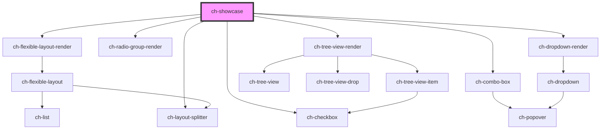

# ch-showcase

<!-- Auto Generated Below -->

## Properties

| Property        | Attribute        | Description                                                                | Type                | Default     |
| --------------- | ---------------- | -------------------------------------------------------------------------- | ------------------- | ----------- |
| `componentName` | `component-name` | Specifies the name of the control.                                         | `string`            | `undefined` |
| `pageName`      | `page-name`      | Specifies the title for the current showcase.                              | `string`            | `undefined` |
| `pageSrc`       | `page-src`       | Specifies the HTML directory where the showcase for the control is placed. | `string`            | `undefined` |
| `theme`         | `theme`          | Specifies the theme used in the iframe of the control                      | `"dark" \| "light"` | `undefined` |

## Dependencies

### Depends on

- [ch-flexible-layout-render](../../../../components/flexible-layout)
- [ch-checkbox](../../../../components/checkbox)
- [ch-combo-box](../../../../components/combobox)
- [ch-radio-group-render](../../../../components/radio-group)
- [ch-dropdown-render](../../../../components/dropdown)
- [ch-layout-splitter](../../../../components/layout-splitter)
- [ch-tree-view-render](../../../../components/tree-view)

### Graph

----------------------------------------------

*Built with [StencilJS](https://stenciljs.com/)*
